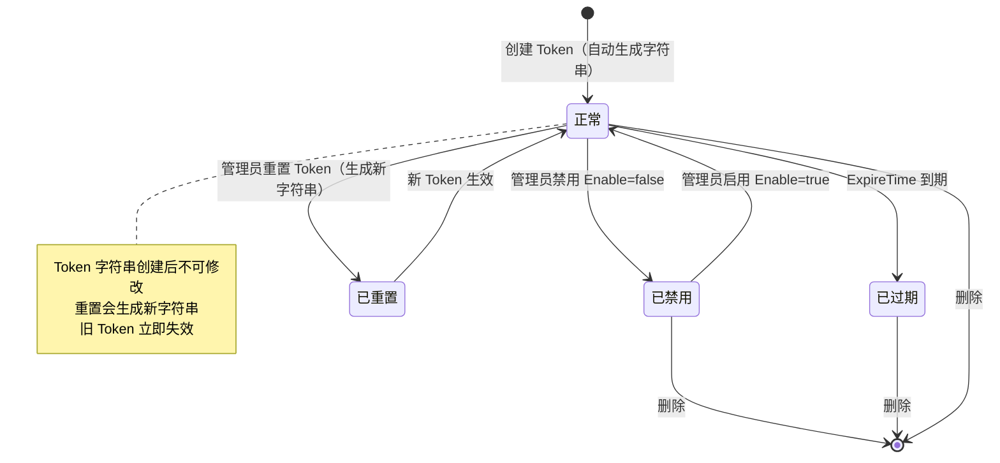

# MCP Token 凭证与资源授权管理

> 版本：v1.0 | 日期：2026-07-22
> 对应模块：MCP 工具服务能力
> 相关文档：[MCP-MCP架构](MCP-MCP架构.md) | [功能清单](功能清单.md) §MCP

---

## 1. 概述

MCP 使用独立的**资源授权 Token 体系**，每份 Token 显式绑定可访问的项目、节点、应用集合，禁用 Token 即立即失去对相应资源的访问能力。该体系独立于 Web 用户登录态和 Cube 框架 Cookie/Session 鉴权。

---

## 2. Token 凭证管理

### 2.1 数据表（McpToken）

| 字段 | 类型 | 说明 |
|---|---|---|
| Id | Int32 | 主键 |
| Name | String(50) | Token 名称，如"运维助手-小明" |
| Token | String(64) | Token 字符串，格式 `sdmcp_` + 32 位 Base62，创建后不可修改 |
| Enable | Boolean | 启用状态，false 时所有调用返回 `-32001` |
| ExpireTime | DateTime? | 过期时间，null 表示永不过期 |
| LastTime | DateTime? | 最后调用时间 |
| LastIP | String(50) | 最后调用方 IP |
| CallCount | Int32 | 累计调用次数 |
| Remark | String(500) | 备注 |

### 2.2 Token 生命周期



### 2.3 安全要求

- **Token 格式**：`sdmcp_` 前缀 + 32 位 Base62 随机字符（大小写字母+数字）
- **恒定时间比较**：Token 校验使用 `SafeEquals` 方法，防时序攻击
- **日志脱敏**：Token 字符串不在日志中明文打印
- **列表页隐藏**：Web 管理列表页隐藏 Token 字段，仅创建/重置时显示一次
- **创建后不可修改**：如需更换请用"重置"功能，生成新 Token 并保留资源授权关系

---

## 3. 资源授权管理

### 3.1 数据表（McpTokenResource）

| 字段 | 类型 | 说明 |
|---|---|---|
| Id | Int32 | 主键 |
| TokenId | Int32 | 关联 `McpToken.Id` |
| ResourceType | String(20) | 资源类型：`Project` / `Node` / `App` |
| ResourceId | Int32 | 资源 ID |
| IsAll | Boolean | 是否授权该类型的"全部资源"。true 时忽略 ResourceId |
| Enable | Boolean | 启用状态（支持临时禁用某条授权而不删除） |

### 3.2 授权模型

| 授权类型 | 语义 | 典型场景 |
|---|---|---|
| **Project 授权** | 授权项目 → 该项目下所有节点/应用/部署集/流水线/配置均可访问 | 用"运维助手"管理整个项目 |
| **Node 授权** | 可单独操作该节点（跨项目授权） | 运维"数据库集群节点"（不论属于哪个项目） |
| **App 授权** | 可单独操作该应用（跨项目授权） | 运维"核心支付应用"（不论属于哪个项目） |
| **IsAll=true** | 该类型下的所有资源（含未来新增）均允许访问 | 管理员 Token 需要全权限 |

三种授权关系为 **OR 关系**：只要任一类型有授权，即可访问对应资源。如 Token 授权了"项目 A"且授权了"节点 X（属于项目 B）"，则 Token 既能访问项目 A 的所有资源，也能访问节点 X。

### 3.3 Web 管理界面

Token 表单页面（`/Platform/McpToken/_Form_Body.cshtml`）提供三类资源的勾选界面：

```
┌─────────────────────────────────────────────┐
│  Token 表单                                  │
├─────────────────────────────────────────────┤
│  名称: [  运维助手-小明  ]                    │
│  备注: [  用于 IDE 集成     ]                  │
│  过期时间: [  2027-12-31  ]                   │
├─────────────────────────────────────────────┤
│  ☑ 项目授权                                  │
│    ☑ 全部项目                                │
│    ☐ 项目 A  ☑ 项目 B  ☐ 项目 C              │
├─────────────────────────────────────────────┤
│  ☑ 节点授权                                  │
│    ☐ 全部节点                                │
│    ☑ 节点 X (192.168.1.100)                  │
│    ☐ 节点 Y (192.168.1.101)                  │
├─────────────────────────────────────────────┤
│  ☐ 应用授权                                  │
│    ☐ 全部应用                                │
│    ☑ 应用 Alpha  ☐ 应用 Beta                 │
├─────────────────────────────────────────────┤
│  [保存]  [取消]                               │
└─────────────────────────────────────────────┘
```

---

## 4. Web 管理页面

| 页面路径 | 功能 | 说明 |
|---|---|---|
| `/Platform/McpToken` | Token 列表/新建/编辑 | 列表页隐藏 Token 字符串字段 |
| `/Platform/McpToken/Reset/{id}` | 重置 Token | 生成新 Token 字符串，旧 Token 立即失效 |
| `/Platform/McpAudit` | 审计日志列表 | 支持按 TokenId/工具名/动作名/成功与否筛选 |

### 4.1 McpTokenController 关键逻辑

- **列表页**：`ListFields.RemoveField("Token")` — 隐藏 Token 字符串
- **新建**：自动生成 Token 字符串（`sdmcp_` + 32 位 Base62）
- **编辑**：Token 字符串不可修改；同步 `McpTokenResource` 资源授权
- **重置**：生成新 Token 字符串，旧 Token 立即失效，资源授权关系保留
- **删除**：级联删除 `McpTokenResource` 关联记录（`McpAudit` 保留）
- `LogOnChange = true`：记录管理操作历史

---

## 5. 审计日志

### 5.1 数据表（McpAudit）

| 字段 | 类型 | 说明 |
|---|---|---|
| Id | Int64 | 主键（使用 Int64 因预期数据量大） |
| TokenId | Int32 | 关联 `McpToken.Id` |
| TokenName | String(50) | Token 名称快照（Token 删除后仍可审计） |
| ToolName | String(50) | 工具名（5 个 MCP 工具之一） |
| ActionName | String(50) | 动作名（仅 `invoke_action` 时填写） |
| CallerIp | String(50) | 调用方 IP |
| CallerUserAgent | String(200) | 客户端 User-Agent |
| Arguments | String(max) | 入参 JSON（截断 2000 字符，敏感字段脱敏） |
| Success | Boolean | 是否成功 |
| ErrorMessage | String(500) | 失败原因 |
| Duration | Int32 | 耗时（毫秒） |

### 5.2 审计规则

- 每次 `tools.call` 写入一条审计记录
- 审计日志写入失败不影响主调用返回
- 入参中敏感字段（`password`/`secret`/`token`）自动脱敏
- Token 删除后 `McpAudit` 记录保留（通过 `TokenName` 快照可追溯）
