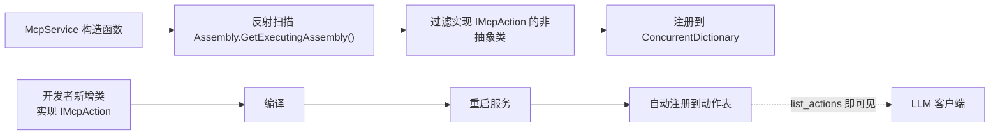

# MCP Action 扩展指南

> 版本：v1.0 | 日期：2026-07-22
> 对应模块：MCP 工具服务能力
> 相关文档：[MCP-MCP架构](MCP-MCP架构.md) | [MCP-1-token管理](MCP-1-token管理.md)

---

## 1. 概述

MCP 的 Action 扩展采用**纯代码驱动**设计：实现 `IMcpAction` 接口或继承 `McpActionBase` 基类，`McpService` 在启动时通过反射自动注册所有实现类。新增功能只需添加一个类文件，无需修改 `McpService` 或任何配置文件。

---

## 2. 接口规范

### 2.1 IMcpAction 接口

```csharp
public interface IMcpAction
{
    String Name { get; }                          // 动作名（snake_case）
    String Description { get; }                   // 动作描述（面向 LLM）
    String Module { get; }                        // 所属模块（node/app/config/deploy/gateway/monitor/system）
    Object InputSchema { get; }                   // JSON Schema 参数定义
    ResourceRequirement? RequiredResource { get; } // 资源依赖声明（null 表示无资源依赖）
    Task<Object> InvokeAsync(JsonElement params, CancellationToken ct);
}
```

### 2.2 McpActionBase 基类

提供 `InputSchema` 的默认实现（空对象），减少样板代码：

```csharp
public abstract class McpActionBase : IMcpAction
{
    public abstract String Name { get; }
    public abstract String Description { get; }
    public abstract String Module { get; }
    public virtual Object InputSchema => new JObject();
    public virtual ResourceRequirement? RequiredResource => null;
    public abstract Task<Object> InvokeAsync(JsonElement params, CancellationToken ct);
}
```

### 2.3 ResourceRequirement

```csharp
public sealed class ResourceRequirement
{
    public String ResourceType { get; init; }     // project / node / app
    public String IdField { get; init; }          // params 中资源 ID 的字段名
    public Boolean Indirect { get; init; }        // true=资源 ID 需通过中间实体反查
    public String IndirectEntity { get; init; }   // 间接查找的实体（如 "AppDeploy"）
}
```

---

## 3. 快速上手：新增一个 Action

### 3.1 示例：新增节点统计 Action

**步骤 1**：在 `Stardust.Web/Mcp/Actions/Node/` 下新建文件 `NodeStatsAction.cs`

```csharp
using System.Text.Json;
using Stardust.Data.Nodes;
using Stardust.Data.Platform;

namespace Stardust.Web.Mcp.Actions.Node;

public class NodeStatsAction : McpActionBase
{
    public override String Name => "node_stats";
    public override String Description => "获取指定节点的统计信息（CPU/内存/磁盘）";
    public override McpModuleType Module => McpModuleType.Node;
    public override ResourceRequirement? RequiredResource =>
        new() { ResourceType = "node", IdField = "node_id" };

    public override Object InputSchema => new JObject
    {
        ["type"] = "object",
        ["properties"] = new JObject
        {
            ["node_id"] = new JObject
            {
                ["type"] = "integer",
                ["description"] = "节点 ID"
            }
        },
        ["required"] = new JArray("node_id")
    };

    public override Task<Object> InvokeAsync(JsonElement params, CancellationToken ct)
    {
        var nodeId = params.GetProperty("node_id").GetInt32();
        var node = Node.FindByID(nodeId);
        if (node == null)
            throw new McpException($"Node {nodeId} not found", -32000);

        // 业务逻辑：收集节点统计信息
        return Task.FromResult<Object>(new
        {
            node_id = node.ID,
            node_name = node.Name,
            cpu_usage = node.CPU,
            memory_usage = node.Memory,
            disk_usage = node.Disk,
            last_ping = node.LastPing
        });
    }
}
```

**步骤 2**：编译并重启 Stardust.Web

**步骤 3**：验证

```bash
# list_actions 中包含新 Action
curl -X POST http://localhost:6600/mcp \
  -H "Authorization: Bearer sdmcp_xxx" \
  -H "Content-Type: application/json" \
  -d '{"jsonrpc":"2.0","id":1,"method":"tools.call","params":{"name":"list_actions","arguments":{"module":"node"}}}'

# 调用新 Action
curl -X POST http://localhost:6600/mcp \
  -H "Authorization: Bearer sdmcp_xxx" \
  -H "Content-Type: application/json" \
  -d '{"jsonrpc":"2.0","id":2,"method":"tools.call","params":{"name":"invoke_action","arguments":{"action_name":"node_stats","params":{"node_id":100}}}}'
```

### 3.2 无资源依赖的 Action

若 Action 不需要资源授权校验（如系统信息查询），`RequiredResource` 返回 `null`：

```csharp
public override ResourceRequirement? RequiredResource => null;
```

### 3.3 间接资源校验的 Action

若 Action 需要间接校验（如通过 `deploy_id` 反查 `ProjectId`）：

```csharp
public override ResourceRequirement? RequiredResource =>
    new() { ResourceType = "project", IdField = "deploy_id", Indirect = true, IndirectEntity = "AppDeploy" };
```

支持三种间接实体映射：

| IndirectEntity | 实体类 | 映射字段 |
|---|---|---|
| `AppDeploy` | `Stardust.Data.Platform.AppDeploy` | `FindById(id)?.ProjectId` |
| `AppPipeline` | `Stardust.Data.Platform.AppPipeline` | `FindById(id)?.ProjectId` |
| `AppPipelineRun` | `Stardust.Data.Platform.AppPipelineRun` | `FindById(id)?.ProjectId` |

---

## 4. 注册机制



### 4.1 注册规则

- 扫描程序集：`Assembly.GetExecutingAssembly()`（当前运行时程序集）
- 过滤条件：实现 `IMcpAction` 接口且非抽象类
- 存储结构：`ConcurrentDictionary<String, IMcpAction>`
- 动作名冲突：同名时后注册的覆盖先注册的（启动时 log warn）

### 4.2 McpActionSet 过滤

- `list_actions` 根据 `StarServerSetting.McpActionSet` 配置过滤
- `McpActionSet = "*"`：返回全部 action
- `McpActionSet = "node,app"`：只返回 node 和 app 模块的 action
- 被禁用的 action 调用返回 `-32601`

---

## 5. 约定与最佳实践

### 5.1 命名约定

| 规则 | 示例 |
|---|---|
| Action 名使用 snake_case | `node_send_command`、`deploy_install` |
| 模块名使用小写单数 | `node`、`app`、`config`、`deploy`、`gateway`、`monitor`、`system` |
| 类名使用 PascalCase + `Action` 后缀 | `NodeSendCommandAction`、`DeployInstallAction` |
| 文件位于对应模块子目录 | `Stardust.Web/Mcp/Actions/{Module}/{Name}Action.cs` |

### 5.2 开发约束

| 约束 | 说明 |
|---|---|
| **Action 内不校验授权** | 资源授权校验由框架层统一完成，Action 仅做业务合法性校验 |
| **异常安全** | Action 抛出异常会被 McpService 捕获，转换为 JSON-RPC `-32000` |
| **超时控制** | Action 执行超时默认为 30 秒，超时返回 `-32002` |
| **InputSchema 必填** | 所有 Action 必须提供 `InputSchema`，否则 LLM 无法正确传参 |
| **Description 面向 LLM** | `Description` 应描述动作的功能和典型使用场景，而非实现细节 |
| **依赖注入** | Action 构造函数注入所需的 Service（如 `StarFactory`、`DeployService`） |

### 5.3 项目目录结构

```
Stardust.Web/Mcp/
├── IMcpAction.cs              # 接口 + 基类 + ResourceRequirement
├── McpContext.cs              # 当前调用上下文
├── Actions/
│   ├── Node/                  # 节点管理（4 个）
│   │   ├── NodeListOnlineAction.cs
│   │   ├── NodeSendCommandAction.cs
│   │   ├── NodeUpgradeAction.cs
│   │   └── NodeSearchAction.cs
│   ├── App/                   # 应用管理（7 个）
│   │   ├── AppListOnlineAction.cs
│   │   ├── AppSendCommandAction.cs
│   │   ├── AppResolveServiceAction.cs
│   │   ├── AppSearchServiceAction.cs
│   │   ├── AppRestartAction.cs
│   │   ├── AppStopAction.cs
│   │   └── AppStartAction.cs
│   ├── Config/                # 配置中心（2 个）
│   │   ├── ConfigGetAction.cs
│   │   └── ConfigSetAction.cs
│   ├── Deploy/                # 远程发布（9 个）
│   │   ├── DeployListAction.cs
│   │   ├── DeployCompileAction.cs
│   │   ├── DeployListVersionsAction.cs
│   │   ├── DeployListHistoryAction.cs
│   │   ├── DeployListNodesAction.cs
│   │   ├── DeployInstallAction.cs
│   │   ├── PipelineTriggerAction.cs
│   │   ├── PipelineGetRunAction.cs
│   │   └── PipelineCancelAction.cs
│   ├── Gateway/               # 网关管理（2 个）
│   │   ├── GatewayListRoutesAction.cs
│   │   └── GatewayListClustersAction.cs
│   ├── Monitor/               # 监控中心（2 个）
│   │   ├── MonitorTraceSearchAction.cs
│   │   └── MonitorAlarmListAction.cs
│   └── System/                # 系统（1 个）
│       └── GetAuditLogAction.cs
└── Resources/                 # 资源 Provider
    ├── IResourceProvider.cs
    ├── ProjectResourceProvider.cs
    ├── NodeResourceProvider.cs
    ├── AppResourceProvider.cs
    ├── DeployResourceProvider.cs
    ├── PipelineResourceProvider.cs
    └── ServiceResourceProvider.cs
```

### 5.4 权限模型

```csharp
// ❌ 错误：Action 内校验资源授权
public override Task<Object> InvokeAsync(JsonElement params, CancellationToken ct)
{
    var nodeId = params.GetProperty("node_id").GetInt32();
    if (!IsNodeAuthorized(nodeId))  // 框架层已校验，此处重复！
        throw new McpException("Forbidden", -32003);
    // ...
}

// ✅ 正确：Action 仅做业务合法性校验
public override Task<Object> InvokeAsync(JsonElement params, CancellationToken ct)
{
    var nodeId = params.GetProperty("node_id").GetInt32();
    var node = Node.FindByID(nodeId);
    if (node == null)  // 业务合法性校验，非授权校验
        throw new McpException($"Node {nodeId} not found", -32000);
    // ...
}
```

---

## 6. 验证清单

| 验证项 | 方法 | 预期 |
|---|---|---|
| Action 自动注册 | `list_actions` 包含新 action | 新 action 名称和 schema 正确 |
| Action 调用成功 | `invoke_action` 带正确参数 | 返回业务结果 |
| 参数校验 | 缺少必填参数 | 返回 `-32602` |
| 资源授权 | 调用未授权资源的 action | 返回 `-32003` |
| 动作禁用 | `McpActionSet` 排除该模块 | 返回 `-32601` |
| Action 异常 | Action 内抛异常 | 返回 `-32000` 含错误信息 |
