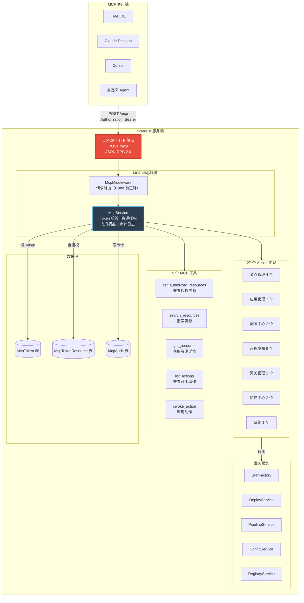

# MCP HTTP 服务架构

> 版本：v1.0 | 日期：2026-07-22
> 对应模块：MCP 工具服务能力
> 相关文档：[需求文档](需求文档.md) §3.13 | [功能清单](功能清单.md) §MCP | [MCP-1-token管理](MCP-1-token管理.md) | [MCP-2-action扩展](MCP-2-action扩展.md)

---

## 1. 背景与目标

### 1.1 为什么需要 MCP

Stardust 已具备完整的"节点管理 + 应用管理 + 配置中心 + 注册中心 + 监控中心 + 远程发布 + 网关管理"能力（M1–M12 共 117 个功能），但所有能力**只能通过 Web 控制台或私有 RPC 协议**调用，**无法被 LLM/智能体直接消费**。

MCP（Model Context Protocol）是 Anthropic 主导的事实标准，已被主流 IDE/Agent（Trae、Claude Desktop、Cursor）原生支持。通过在 Stardust 服务端实现 MCP HTTP 端点，可让任意 MCP 客户端把 Stardust 当作一个工具服务器调用，**无需为每个 Agent 重新开发适配层**。

### 1.2 设计原则

1. **最小暴露**：MCP 协议层面只暴露 5 个工具，避免工具列表臃肿
2. **工具聚焦协议原语**：MCP 工具聚焦"协议级查询原语"（授权发现/搜索/获取/动作发现/动作调用），业务操作统一走 `invoke_action`
3. **代码驱动扩展**：新增 Action 只需实现 `IMcpAction` 接口，零配置零侵入
4. **框架层统一鉴权**：资源授权校验统一由 `McpService` 框架层完成，Action 内不再重复校验
5. **独立 Token 体系**：独立于 Web 用户登录态，Token 显式绑定可访问的资源集合

---

## 2. 系统架构

### 2.1 整体拓扑



### 2.2 模块职责

| 组件 | 职责 | 所属项目 |
|---|---|---|
| `McpMiddleware` | 接收 HTTP 请求，解析 JSON-RPC，路由到 `McpService`（在 Cube 前短路，避免 device-id cookie 崩溃） | `Stardust.Web/` |
| `McpService` | Token 校验、资源授权检查、动作注册与路由、审计日志写入 | `Stardust.Web/Services/` |
| `IMcpAction` / `McpActionBase` | 动作接口定义与基类实现 | `Stardust.Web/Mcp/` |
| `IResourceProvider` | 资源详情查询接口（6 类资源） | `Stardust.Web/Mcp/Resources/` |
| `McpToken` | MCP 调用凭证（启用状态/过期时间/调用统计） | `Stardust.Data/Platform/` |
| `McpTokenResource` | Token 与资源（项目/节点/应用）的授权关系 | `Stardust.Data/Platform/` |
| `McpAudit` | 每次工具调用的审计日志 | `Stardust.Data/Platform/` |

### 2.3 调用流程

```
MCP 客户端
  │ POST /mcp  Authorization: Bearer {token}
  ▼
McpMiddleware
  │ 1. 从 Header 取 Token
  │ 2. 查 McpToken 表：Token 是否存在、Enable=true、未过期
  │    ↓ 失败 → 返回 -32001
  │ 3. 更新 McpToken.LastTime/LastIP/CallCount
  │ 4. 解析 JSON-RPC method
  │    ├─ initialize → 返回 serverInfo
  │    ├─ tools.list → 返回 5 个固定工具
  │    └─ tools.call {name, arguments}
  │         ├─ list_authorized_resources → 直接返回 Token 授权资源
  │         ├─ search_resources → 按 Token 授权范围过滤返回搜索结果
  │         ├─ list_actions → 返回 McpActionSet 过滤后的动作清单
  │         ├─ get_resource → 框架层校验 + 路由到资源 Provider
  │         └─ invoke_action → action 查找 → inputSchema 校验
  │              → 框架层资源授权校验 → 调用 InvokeAsync → 写审计
  ▼
MCP 客户端（JSON-RPC 响应）
```

---

## 3. 协议设计

### 3.1 端点

- **路径**：`POST /mcp`
- **协议**：JSON-RPC 2.0
- **鉴权**：`Authorization: Bearer {McpToken}`
- **传输**：纯 HTTP（单请求单响应），暂不实现 SSE 长连接

### 3.2 JSON-RPC 方法

| 方法 | 说明 |
|---|---|
| `initialize` | 协议握手，返回 `serverInfo`（name=`Stardust`）和 `capabilities` |
| `tools.list` | 返回 5 个固定工具的清单 |
| `tools.call` | 调用指定工具，传入 `name` 和 `arguments` |

### 3.3 5 个 MCP 工具

| 工具名 | 描述 | 入参 | 资源校验 |
|---|---|---|---|
| `list_authorized_resources` | 查询当前 Token 授权了哪些资源 | `resource_type?`（Project/Node/App） | 无 |
| `search_resources` | 按关键字跨类型搜索资源 | `keyword`(必填)、`resource_type?` | 无（按授权过滤结果） |
| `get_resource` | 按资源类型+ID 获取单个资源详情 | `resource_type`(必填)、`resource_id`(必填) | 根据 resource_type 动态校验 |
| `list_actions` | 返回当前可调用的动作清单 | `module?`（node/app/config 等） | 无 |
| `invoke_action` | 调用指定动作 | `action_name`(必填)、`params`(必填) | 由 action 的 RequiredResource 声明 |

### 3.4 错误码

| 错误码 | 含义 | 说明 |
|---|---|---|
| `-32700` | Parse error | JSON 解析失败 |
| `-32600` | Invalid Request | 请求格式错误 |
| `-32601` | Method not found | 未识别的 method / action 被禁用 |
| `-32602` | Invalid params | 参数校验失败 |
| `-32000` | Server error | 服务端内部异常 |
| `-32001` | Unauthorized | Token 不存在/禁用/过期 |
| `-32002` | Timeout | 动作执行超时（默认 30 秒） |
| `-32003` | Forbidden | 资源未授权 |

---

## 4. 鉴权与授权模型

### 4.1 Token 体系

MCP 使用独立的**资源授权 Token 体系**，独立于 Web 用户登录态。

- Token 格式：`sdmcp_` 前缀 + 32 位 Base62 随机字符
- Token 创建后不可修改（支持重置生成新 Token）
- Token 支持 `Enable` 开关和 `ExpireTime` 过期时间
- Token 校验使用**恒定时间比较**防时序攻击

### 4.2 资源授权模型

三类资源授权互为 OR 关系：

| 资源类型 | 说明 | 语义 |
|---|---|---|
| **Project** | 项目授权 | 授权项目 → 该项目下所有节点/应用/部署集/流水线/配置均可访问 |
| **Node** | 节点授权 | 可单独操作该节点（独立于项目授权） |
| **App** | 应用授权 | 可单独操作该应用（独立于项目授权） |
| **IsAll=true** | 通配授权 | 该类型下的所有资源（含未来新增的）均允许访问 |

### 4.3 授权校验层级

```
框架层统一校验（McpService）
├─ 直接校验：params 中字段名 → McpTokenResource 表校验
│  例：node_send_command params.node_id → 查 McpTokenResource(ResourceType=Node, ResourceId=?)
│
├─ 间接校验：通过 IndirectEntity 反查 ProjectId/AppId
│  例：deploy_install params.deploy_id → AppDeploy.FindById → 查 ProjectId → 校验项目授权
│
└─ 列表过滤：列表类 action 按 Token 授权范围过滤返回数据
   例：node_list_online 只返回 Token 授权项目下的在线节点

Action 实现内部
└─ 仅做业务合法性校验（如"deploy 是否存在"）
```

---

## 5. 首批 Action 清单（27 个）

### 5.1 节点管理（node）— 4 个

| 动作名 | 描述 | 资源依赖 |
|---|---|---|
| `node_list_online` | 列出在线节点 | 无（按 Token 授权项目过滤返回） |
| `node_send_command` | 向节点下发命令 | node / `node_id` |
| `node_upgrade` | 触发节点升级检查 | node / `node_id` |
| `node_search` | 按名称/IP/编码搜索节点 | 无（按 Token 授权项目过滤返回） |

### 5.2 应用管理（app）— 7 个

| 动作名 | 描述 | 资源依赖 |
|---|---|---|
| `app_list_online` | 列出在线应用 | 无（按 Token 授权项目过滤返回） |
| `app_send_command` | 向应用下发命令 | app / `app_id` |
| `app_resolve_service` | 解析服务地址 | 无（公开服务发现） |
| `app_search_service` | 搜索已注册服务 | 无（公开服务发现） |
| `app_restart` | 重启应用 | app / `app_id` |
| `app_stop` | 停止应用 | app / `app_id` |
| `app_start` | 启动应用 | app / `app_id` |

### 5.3 配置中心（config）— 2 个

| 动作名 | 描述 | 资源依赖 |
|---|---|---|
| `config_get` | 获取应用配置 | app / `app_id` |
| `config_set` | 设置应用配置项 | app / `app_id` |

### 5.4 远程发布（deploy）— 9 个

| 动作名 | 描述 | 资源依赖 |
|---|---|---|
| `deploy_list` | 列出应用部署集 | 无（按 Token 授权项目过滤返回） |
| `deploy_compile` | 触发编译（不部署） | project（间接）+ node（可选） |
| `deploy_list_versions` | 列出部署版本 | project（间接） |
| `deploy_list_history` | 列出部署历史 | project（间接） |
| `deploy_list_nodes` | 列出部署目标节点 | project（间接） |
| `deploy_install` | 触发部署到指定节点 | project（间接）+ node |
| `pipeline_trigger` | 手动触发流水线 | project（间接） |
| `pipeline_get_run` | 查询流水线运行状态 | project（间接） |
| `pipeline_cancel` | 取消正在运行的流水线 | project（间接） |

### 5.5 网关管理（gateway）— 2 个

| 动作名 | 描述 | 资源依赖 |
|---|---|---|
| `gateway_list_routes` | 列出网关路由 | 无 |
| `gateway_list_clusters` | 列出网关集群 | 无 |

### 5.6 监控中心（monitor）— 2 个

| 动作名 | 描述 | 资源依赖 |
|---|---|---|
| `monitor_trace_search` | 搜索调用链 | app / `app_id`（可选） |
| `monitor_alarm_list` | 列出告警记录 | app / `app_id`（可选） |

### 5.7 系统（system）— 1 个

| 动作名 | 描述 | 资源依赖 |
|---|---|---|
| `get_audit_log` | 查询当前 Token 最近调用记录 | 无（仅查当前 Token） |

---

## 6. 开关配置

| 配置项 | 类型 | 默认值 | 说明 |
|---|---|---|---|
| `StarServerSetting.EnableMcp` | Boolean | `false` | MCP 服务总开关。关闭时 `/mcp` 返回 404 |
| `StarServerSetting.McpActionSet` | String | `*` | 启用的动作集，逗号分隔；`*` 表示全部启用 |

> Token 本身有 `Enable` 字段可单独禁用；`EnableMcp` 是全局开关，关闭后所有 Token 都无法调用。

---

## 7. 扩展机制

详见 [MCP-2-action扩展](MCP-2-action扩展.md)。

新增 MCP 动作的步骤：

1. 在 `Stardust.Web/Mcp/Actions/{Module}/` 下新建类，实现 `IMcpAction`（或继承 `McpActionBase`）
2. 填写 `Name` / `Description` / `Module` / `InputSchema` / `RequiredResource`
3. 实现 `InvokeAsync` 方法（仅业务逻辑，无需授权校验）
4. 重启 Stardust.Server，`McpService` 自动反射注册

**无需**：修改 Controller、修改 Service 注册代码、修改数据库配置、修改前端代码。

---

## 8. 审计日志

每次 `tools.call` 在 `McpAudit` 表中记录一条审计日志，含：

| 字段 | 说明 |
|---|---|
| TokenId / TokenName | 调用方身份（TokenName 为快照，Token 删除后仍可审计） |
| ToolName / ActionName | 调用的工具名和动作名 |
| CallerIp / CallerUserAgent | 调用来源 |
| Arguments | 入参 JSON（截断 2000 字符，敏感字段脱敏） |
| Success / ErrorMessage | 执行结果 |
| Duration | 耗时（ms） |

审计日志写入失败不影响主调用返回。

---

## 9. 影响范围

- 新增 3 张数据表（`McpToken` / `McpTokenResource` / `McpAudit`），不影响已有实体
- 新增 `McpMiddleware`（在 Cube 前短路 `/mcp`），独立鉴权，不干扰现有 `[ApiFilter]` / JWT 链路
- 新增 27 个 `IMcpAction` 实现，复用已有的 `StarFactory` / `DeployService` / `PipelineService` 等
- **不改动** 任何已有 Controller、Service、实体表的对外行为
