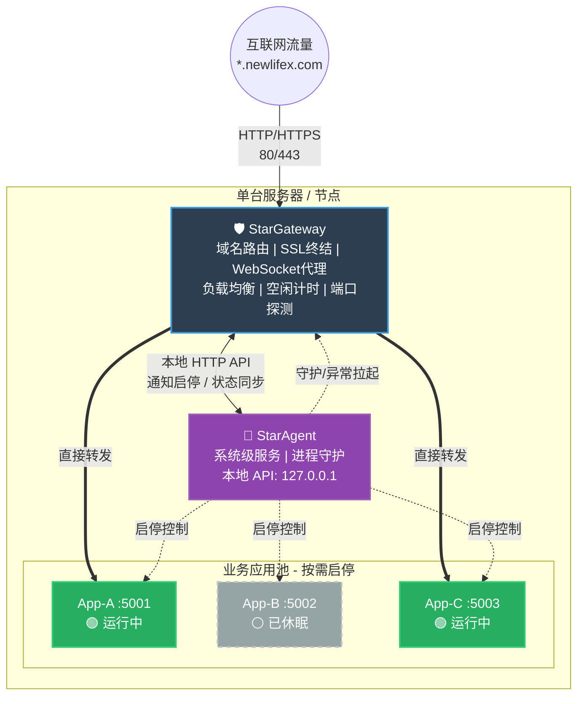
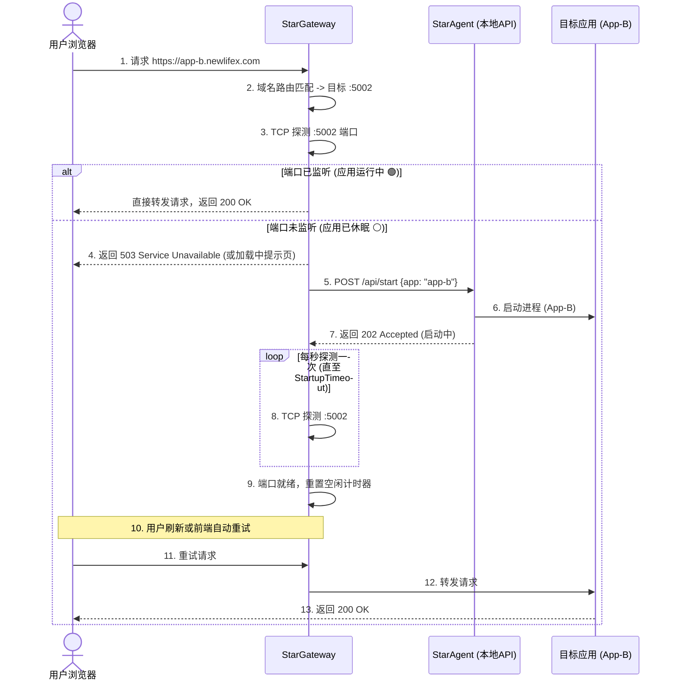
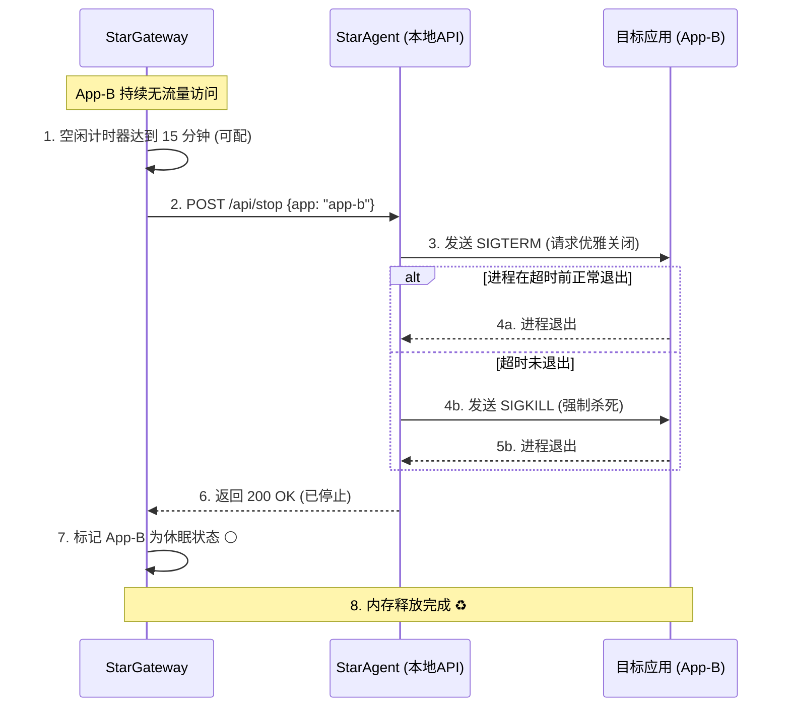
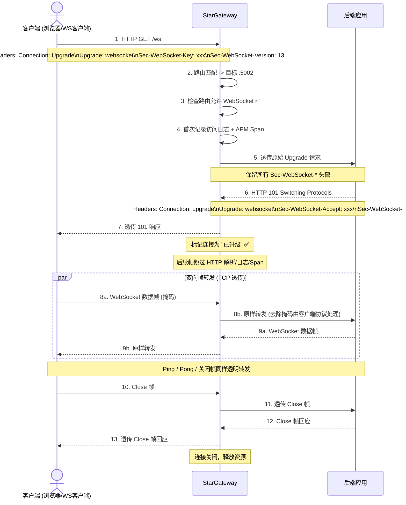

### 1. 系统整体架构图
展示 StarGateway、StarAgent 与业务应用之间的拓扑关系与职责划分。

---

### 2. 请求唤醒流程（冷启动）
展示当应用处于休眠状态时，流量到达后的完整交互时序。

---

### 3. 空闲回收流程（自动休眠）
展示应用长时间无流量时的资源回收时序。

---

### 4. WebSocket 代理流程（升级握手）
展示客户端通过 HTTP Upgrade 机制建立 WebSocket 长连接的完整交互。

### 5. 设计亮点总结
1. **TCP 探测解耦**：Gateway 不依赖 Agent 回报状态，直接探测端口，最真实反映应用是否具备服务能力。
2. **503 降级与重试**：冷启动期间不阻塞 Gateway 线程，通过 503 状态码让客户端（或前端 JS）自动重试，体验平滑。
3. **优雅与强制结合**：停止应用时先发 `SIGTERM` 给 .NET 应用处理收尾工作，超时再 `SIGKILL`，保证数据不丢失。
4. **WebSocket 零开销透传**：升级握手完成后，Gateway 在 TCP 层面透明转发帧数据，不解析帧内容、不产生额外日志和 APM Span，对长连接场景零性能影响。
5. **路由级 WebSocket 开关**：每路由可独立控制是否允许 WebSocket 升级，避免非目标路由被利用为 WebSocket 隧道。
6. **仅首次日志规则**：WebSocket 升级请求以外的帧不产生访问日志和链路追踪 Span，大幅降低长连接日志量。