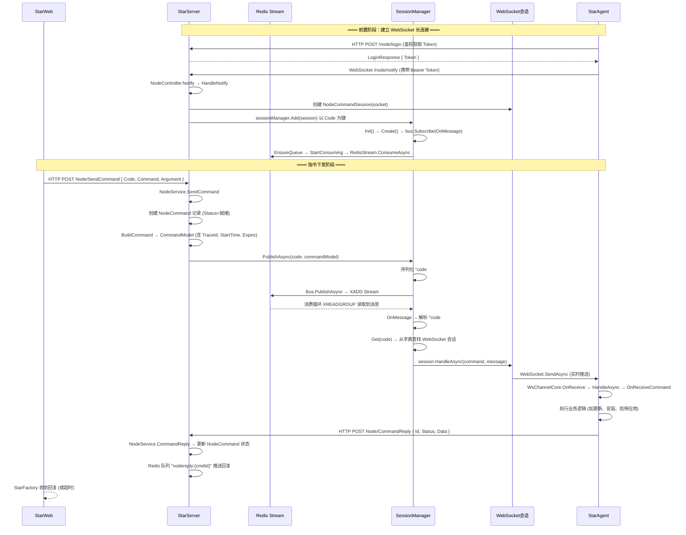
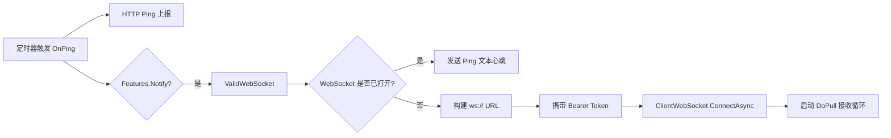
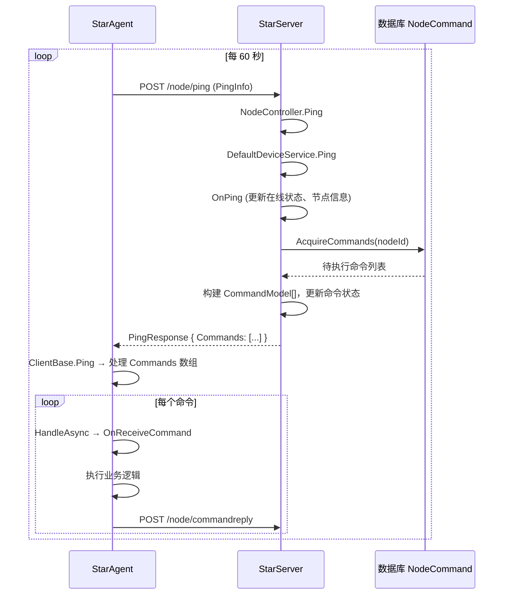

# 指令下发全链路架构分析

> **更新日期**：2026-06-22
> **状态**：WebSocket 通道故障排查中，心跳备用通道正常工作

---

## 1. 架构概览

星尘平台指令下发采用 **双通道互为备份** 的架构设计：

| 通道 | 机制 | 延迟 | 当前状态 |
|------|------|------|----------|
| **WebSocket 实时推送** | SessionManager → RedisStream 事件总线 → WebSocket 长连接 | 实时（毫秒级） | ❌ 故障 |
| **HTTP 心跳拉取** | Ping → AcquireCommands → PingResponse.Commands | 最多 60 秒 | ✅ 正常 |

### 1.1 组件关系全景图

```mermaid
graph TB
    subgraph StarWeb["StarWeb (管理端)"]
        SF[StarFactory]
        AC[AppClient]
    end

    subgraph StarServer["StarServer (服务端)"]
        NC[NodeController]
        NS[NodeService]
        NSM[NodeSessionManager]
        SM[SessionManager]
        REB[RedisEventBus]
        NCS[(NodeCommandSession<br/>WebSocket 会话池)]
        RS[(Redis Stream<br/>NodeCommands)]
    end

    subgraph StarAgent["StarAgent (节点端)"]
        SC[StarClient]
        CB[ClientBase]
        WCC[WsChannelCore<br/>WebSocket 客户端]
    end

    subgraph DB[("数据库")]
        NC_TAB[(NodeCommand<br/>命令表)]
    end

    SF -->|"HTTP POST<br/>Node/SendCommand"| NC
    NC --> NS
    NS --> NC_TAB
    NS -->|"PublishAsync"| SM
    SM -->|"EventBus.Publish"| REB
    REB -->|"XADD"| RS
    RS -->|"XREADGROUP 消费循环"| REB
    REB -->|"OnMessage 回调"| SM
    SM -->|"Get(code) 查找会话"| NCS
    NCS -->|"WebSocket.SendAsync"| WCC
    WCC -->|"OnReceive"| CB
    CB -->|"HandleAsync"| SC

    SC -->|"HTTP Ping 心跳"| NC
    NC -->|"Ping 处理"| NS
    NS -->|"AcquireCommands"| NC_TAB
    NC_TAB -->|"命令列表"| NS
    NS -->|"PingResponse.Commands"| NC
    NC -->|"HTTP 响应"| SC
```

### 1.2 通道切换逻辑

```text
WebSocket 推送成功 → 实时送达 → 客户端立即执行
WebSocket 推送失败 → 命令留存在 DB → 下次心跳拉取 → 客户端延迟执行（≤60s）
```

**设计意图**：心跳拉取通道是 WebSocket 推送通道的**兜底保障**，两者并非竞态关系，而是主备关系。

---

## 2. WebSocket 实时推送通道（主路径）

### 2.1 完整时序



### 2.2 各环节详解

#### 2.2.1 客户端建立 WebSocket（StarAgent 侧）

**入口**：`ClientBase.OnPing()` 每次心跳周期调用



关键文件：`D:\X\NewLife.Remoting\NewLife.Remoting\Clients\WsChannelCore.cs`

**关键代码**（第 43-80 行）：

```csharp
public override async Task ValidWebSocket(ApiHttpClient http)
{
    var svc = http.Current;
    if (svc == null) return;

    var token = http.Token;
    if (token.IsNullOrEmpty()) return;  // ⚠️ 令牌为空时静默跳过

    // 已连接则发送心跳
    if (_websocket != null && _websocket.State == WebSocketState.Open) { /* Ping */ }

    // 重新连接
    if (_websocket == null || _websocket.State != WebSocketState.Open)
    {
        var url = svc.Address.ToString().Replace("http://", "ws://");
        var uri = new Uri(new Uri(url), "/node/notify");
        var ws = new ClientWebSocket();
        ws.Options.SetRequestHeader("Authorization", "Bearer " + token);
        await ws.ConnectAsync(uri, default);
        _websocket = ws;
        _ = Task.Factory.StartNew(() => DoPull(ws, _source), TaskCreationOptions.LongRunning);
    }
}
```

#### 2.2.2 服务端接受 WebSocket（StarServer 侧）

**入口**：`NodeController.Notify()` → `HandleNotify(socket)`

```mermaid
flowchart TD
    A[客户端 ws://server/node/notify] --> B[NodeController.Notify]
    B --> C[AcceptWebSocketAsync]
    C --> D[HandleNotify]
    D --> E[创建 NodeCommandSession]
    E --> F["session.Code = node.Code"]
    F --> G[sessionManager.Add(session)]
    G --> H["字典 _dic[nodeCode] = session"]
    H --> I[session.WaitAsync 阻塞等待]
    I --> J{循环接收消息}
    J -->|Ping| K[响应 Pong + 刷新在线]
    J -->|业务消息| L[处理]
    J -->|Close/异常| M[退出循环]
    M --> N[SetOnline(false) 通知下线]
```

关键文件：

- `d:\X\Stardust\Stardust.Server\Controllers\NodeController.cs` 第 254 行
- `d:\X\Stardust\Stardust.Server\Services\NodeSessionManager.cs` 第 24 行

#### 2.2.3 指令发布（StarWeb → StarServer）

**入口**：`StarFactory.SendNodeCommand(nodeCode, command, argument)`

调用链：

```text
StarFactory.SendNodeCommand
  → AppClient.InvokeAsync("Node/SendCommand", CommandInModel)
    → HTTP POST 到 StarServer
      → NodeController.SendCommand
        → NodeService.SendCommand
```

关键文件：`d:\X\Stardust\Stardust.Server\Services\NodeService.cs` 第 947-1010 行

**核心代码**：

```csharp
public async Task<CommandReplyModel> SendCommand(Node node, CommandInModel model, ...)
{
    // 1. 写入命令记录到数据库
    var cmd = new NodeCommand
    {
        NodeID = node.ID,
        Command = model.Command,
        Argument = model.Argument,
        Status = CommandStatus.就绪,
        TraceId = DefaultSpan.Current?.TraceId,
    };
    cmd.Insert();

    // 2. 构建 CommandModel
    var commandModel = BuildCommand(node, cmd);

    // 3. 通过 SessionManager 发布到事件总线
    await _sessionManager.PublishAsync(code, commandModel, null, cancellationToken);

    // 4. 等待 Redis 队列回复（timeout 秒）
    if (timeout > 0)
    {
        var q = _cacheProvider.GetQueue<CommandReplyModel>($"nodereply:{cmd.Id}");
        var reply = await q.TakeOneAsync(timeout, cancellationToken);
        if (reply != null) return reply;
    }

    return null;  // ⚠️ 超时返回 null，无法区分"未送达"还是"已送达无回复"
}
```

#### 2.2.4 事件总线路由（SessionManager → RedisEventBus）

**发布侧**——`SessionManager.PublishAsync`（`SessionManager.cs` 第 173 行）：

```csharp
public virtual Task<Int32> PublishAsync(String code, CommandModel command, String? message, ...)
{
    // 序列化为 "code#json" 格式
    message = $"{code}#{message}";
    // 发布到 RedisEventBus
    return Bus.PublishAsync(message, null, cancellationToken);
}
```

**EventBus 写入 Redis**——`RedisEventBus.PublishAsync`（`RedisEventBus.cs` 第 67 行）：

```csharp
public override Task<Int32> PublishAsync(TEvent @event, ...)
{
    Init();  // 确保 _queue 已创建
    _queue.Add(@event);  // XADD 写入 Redis Stream
    return Task.FromResult(1);
}
```

**消费循环**——`RedisStream.ConsumeAsync`（`RedisStream.cs` 第 1027 行）：

> **旧版（已删除）**：`RedisEventBus.ConsumeMessage` 手动循环，含 NOGROUP 恢复
> **新版**：改用 `RedisStream` 内置的 `ConsumeAsync` 方法，更稳定可靠，支持消费组自动管理

```csharp
public async Task ConsumeAsync(Func<T, Message, CancellationToken, Task> onMessage, CancellationToken cancellationToken = default)
{
    // 消费开始埋点
    using (Redis.Tracer?.NewSpan($"redismq:{topic}:ConsumeBegin", ...))
    {
        // ✅ 自动创建消费组
        if (!group.IsNullOrEmpty()) SetGroup(group);
        ShowInfo();
    }

    while (!cancellationToken.IsCancellationRequested)
    {
        try
        {
            var mqMsg = await TakeMessageAsync(timeout, cancellationToken);
            var msg = mqMsg.GetBody<T>();
            if (msg != null) await onMessage(msg, mqMsg, cancellationToken);
            Acknowledge(mqMsg.Id);  // ACK 确认
        }
        catch (RedisException ex)
        {
            // ✅ NOGROUP / Stream 键丢失 自动恢复
            if (!group.IsNullOrEmpty() && (ex.Message.StartsWithIgnoreCase("NOGROUP")
                || ex.Message.StartsWithIgnoreCase("ERR no such key")))
                SetGroup(group);
        }
        // 其他异常不退出循环，继续重试
    }
}
```

**本地分发**——`SessionManager.OnMessage`（`SessionManager.cs` 第 195 行）：

```csharp
protected virtual async Task OnMessage(String message, IEventContext context, ...)
{
    // 解析 "code#json" 格式
    var code = message[..p];
    message = message[(p + 1)..];

    // 查找 WebSocket 会话
    var session = Get(code);
    if (session != null)
        await session.HandleAsync(msg!, message, cancellationToken);
    else
        span?.AppendTag($"未找到编号为[{code}]的会话");  // ⚠️ 静默失败
}
```

#### 2.2.5 WebSocket 发送到客户端

**服务端发送**——`WsCommandSession.HandleAsync`（`WsCommandSession.cs` 第 85 行）：

```csharp
public override Task HandleAsync(CommandModel command, String? message, ...)
{
    return socket.SendAsync(message.GetBytes(), WebSocketMessageType.Text, true, cancellationToken);
}
```

**客户端接收**——`WsChannelCore.DoPull`（`WsChannelCore.cs` 第 100 行）：

```csharp
while (!source.IsCancellationRequested && socket.State == WebSocketState.Open)
{
    var data = await socket.ReceiveAsync(new ArraySegment<Byte>(buf), source.Token);
    var pk = new ArrayPacket(buf, 0, data.Count);
    await OnReceive(pk, source.Token);  // → HandleAsync → OnReceiveCommand
}
```

---

## 3. HTTP 心跳拉取通道（备用路径）

### 3.1 时序



### 3.2 关键实现

**服务端挂载命令到心跳响应**——`DefaultDeviceService.Ping`（`DefaultDeviceService.cs` 第 285 行）：

```csharp
public virtual IPingResponse Ping(DeviceContext context, IPingRequest? request, IPingResponse? response)
{
    OnPing(context, request);
    var rs = response as IPingResponse2;
    if (rs != null) rs.Commands = AcquireCommands(context);  // ← 挂载命令
    return response;
}
```

**查询待执行命令**——`NodeService.AcquireCommands`（`NodeService.cs` 第 560 行）：

```csharp
public override CommandModel[] AcquireCommands(DeviceContext context)
{
    // 缓存最近 1000 条未执行命令（1 分钟刷新），避免高频查库
    if (_nextTime < DateTime.Now || _totalCommands != NodeCommand.Meta.Count)
    {
        _commands = NodeCommand.AcquireCommands(-1, 1000);
        _nextTime = DateTime.Now.AddMinutes(1);
    }

    // 过滤本节点命令
    var cmds = NodeCommand.AcquireCommands(nodeId, 100);
    foreach (var item in cmds)
    {
        if (item.Times > maxTimes || item.Expire < DateTime.Now)
            item.Status = CommandStatus.取消;
        else
        {
            item.Times++;
            item.Status = CommandStatus.处理中;
            rs.Add(BuildCommand(item.Node, item));
        }
    }
    cmds.Update(false);
    return rs.ToArray();
}
```

**客户端处理心跳命令**——`ClientBase.Ping`（`ClientBase.cs` 第 750 行）：

```csharp
public virtual async Task<IPingResponse?> Ping(CancellationToken cancellationToken = default)
{
    var response = await PingAsync(request, cancellationToken);
    if (response != null)
    {
        var commands = (response as PingResponse)?.Commands;
        if (commands != null && commands.Length > 0)
        {
            foreach (var model in commands)
                await ReceiveCommand(model, null, "Pong", cancellationToken);
        }
    }
    return response;
}
```

---

## 4. RedisEventBus 生命周期（新版）

> **更新日期**：2026-06-22
> 新版代码已将消费循环从手动 `ConsumeMessage` 迁移到 `RedisStream` 内置的 `ConsumeAsync`，
> 解决了旧版中 NOGROUP 恢复缺失和 `_source` 死锁两大致命缺陷。

### 4.1 关键类与方法分离

**文件**：`D:\X\NewLife.Redis\NewLife.Redis\Services\RedisEventBus.cs`

```text
┌─────────────────────────────────────────────────────┐
│                  RedisEventBus<T>                     │
├─────────────────────────────────────────────────────┤
│  _queue         RedisStream<T>   (队列实例)          │
│  _source        CancellationTokenSource (取消令牌)    │
│  _consuming     Int32            (消费中标记, 防重入) │
├─────────────────────────────────────────────────────┤
│  EnsureQueue()   创建 Stream + 设置 Group/Expire     │
│                  仅创建队列，不启动消费               │
│  StartConsuming() ← 启动 RedisStream.ConsumeAsync    │
│                   Interlocked 防重入                  │
│  PublishAsync()  → EnsureQueue → XADD               │
│  SubscribeAsync()→ EnsureQueue + StartConsuming      │
│  OnMessage()     ← 被 ConsumeAsync 回调              │
└─────────────────────────────────────────────────────┘

                     RedisStream<T>
┌─────────────────────────────────────────────────────┐
│  ConsumeAsync(onMessage, cancellationToken)          │
│    ├── SetGroup(group)      ✅ 自动创建消费组        │
│    ├── while loop                                    │
│    │   ├── TakeMessageAsync (XREADGROUP)             │
│    │   ├── onMessage(msg)                            │
│    │   └── Acknowledge(msg.Id)                       │
│    └── catch RedisException                          │
│        └── NOGROUP/ERR no such key                   │
│            └── SetGroup(group) ✅ 自动恢复           │
└─────────────────────────────────────────────────────┘
```

### 4.2 与旧版的关键差异

| 方面 | 旧版 | 新版 |
|------|------|------|
| 消费循环位置 | `RedisEventBus.ConsumeMessage`（手动循环） | `RedisStream.ConsumeAsync`（内置循环） |
| NOGROUP 恢复 | 旧 `ConsumeMessage` 有，但被注释掉；新 `ConsumeAsync` 扩展方法无 | ✅ `RedisStream.ConsumeAsync` 内置恢复 |
| 消费组创建 | `ConsumeMessage` 开头调用 `SetGroup` | ✅ `ConsumeAsync` 开头调用 `SetGroup` |
| 退出清理 | `source.Cancel()` + `_queue = null`（导致死锁） | ✅ 无清理动作，仅等待 cancellationToken |
| _source 死锁 | ❌ `_source` 被 Cancel 但保持非 null，SubscribeAsync 不重建 | ✅ 已修复：只在 Dispose 时 Cancel |
| 消费防重入 | 无 | ✅ `_consuming` Interlocked 标记 |
| 队列创建与消费 | 耦合在 `Init()` 中 | ✅ 分离为 `EnsureQueue()` + `StartConsuming()` |
| Stream 键丢失恢复 | 仅 NOGROUP | ✅ NOGROUP + ERR no such key |
| 异常处理 | Redis异常仅处理 NOGROUP，其他不处理 | ✅ Redis异常全部捕获，非 NOGROUP 也继续循环 |
| 诊断埋点 | 无开始/结束埋点 | ✅ `ConsumeBegin` / `ConsumeEnd` 埋点 |

### 4.3 核心代码

**EnsureQueue —— 仅创建队列**（第 56-67 行）：

```csharp
protected virtual void EnsureQueue()
{
    if (_queue != null) return;
    var stream = cache.GetStream<TEvent>(topic);
    stream.Group = group;
    stream.FromLastOffset = true;
    stream.Expire = TimeSpan.FromDays(3);
    _queue = stream;
}
```

**StartConsuming —— 启动消费循环**（第 75-81 行）：

```csharp
protected virtual void StartConsuming()
{
    if (_source == null) return;
    if (Interlocked.CompareExchange(ref _consuming, 1, 0) != 0) return;  // ✅ 防重入
    _ = _queue!.ConsumeAsync(OnMessage, _source.Token);  // ✅ 内置 NOGROUP 恢复
}
```

**SubscribeAsync —— 一次性初始化**（第 93-104 行）：

```csharp
public override Task<Boolean> SubscribeAsync(IEventHandler<TEvent> handler, ...)
{
    if (_source == null)
    {
        var source = new CancellationTokenSource();
        if (Interlocked.CompareExchange(ref _source, source, null) == null)
        {
            EnsureQueue();       // 先创建队列
            StartConsuming();    // 再启动消费
        }
    }
    return base.SubscribeAsync(handler, clientId, cancellationToken);
}
```

**PublishAsync —— 仅确保队列存在**（第 85-91 行）：

```csharp
public override Task<Int32> PublishAsync(TEvent @event, ...)
{
    EnsureQueue();  // ✅ 只创建队列，不重启消费（与旧版不同）
    _queue.Add(@event);
    return Task.FromResult(1);
}
```

**Dispose —— 优雅退出**（第 42-52 行）：

```csharp
protected override void Dispose(Boolean disposing)
{
    base.Dispose(disposing);
    try { _source?.Cancel(); } catch (ObjectDisposedException) { }
    _source?.TryDispose();
}
```

---

## 5. 薄弱环节与风险点

### 5.1 🔴 致命级（1 项）

| 编号 | 薄弱点 | 文件:行号 | 影响 | 触发条件 |
|------|--------|-----------|------|----------|
| **F1** | **_consuming 标记无复位机制** | `RedisEventBus.cs` 78 | 消费循环因 ThreadAbort/ThreadInterrupt 退出后，_consuming 保持 1，StartConsuming 不再启动新循环 | 极端场景：Thread.Abort / Thread.Interrupt |

> **已在本次代码更新中修复（旧版 F2/F3）**：
> - ~~F2: NOGROUP 恢复逻辑缺失~~ → ✅ 新版 `RedisStream.ConsumeAsync` 内置 NOGROUP + ERR no such key 恢复
> - ~~F3: _source 死锁~~ → ✅ 新版不调用 `source.Cancel()` / `_queue = null`，仅 Dispose 时清理

### 5.2 🟠 严重级

| 编号 | 薄弱点 | 文件:行号 | 影响 |
|------|--------|-----------|------|
| **S1** | **OnMessage 静默失败** | `SessionManager.cs` 226 | 找不到会话时只写 span tag，不通知调用方；StarWeb 干等超时 |
| **S2** | **SendCommand 无前置会话检查** | `NodeService.cs` 990 | PublishAsync 前不验证会话是否存在，向不存在的会话发布 |
| **S3** | **WebSocket 与 Ping 独立存活** | `WsChannelCore.cs` 和 `ClientBase.cs` | WebSocket 断开时 HTTP Ping 仍正常，节点显示在线但命令无法实时推送 |
| **S4** | **CloseAll 释放 Bus 不置 null** | `SessionManager.cs` 268 | 若误调 CloseAll，Init 检测 Bus 非 null 跳过重建，发布到已释放的总线 |

### 5.3 🟡 一般级

| 编号 | 薄弱点 | 文件:行号 | 影响 |
|------|--------|-----------|------|
| **M1** | **StarFactory 超时无诊断信息** | `StarFactory.cs` 526 | 超时返回 null，无法区分未送达、已送达无回复、会话不存在 |
| **M2** | **WsChannel 重连日志不足** | `WsChannelCore.cs` | 排查 WebSocket 断开原因困难，Token 为空时静默跳过无日志 |
| **M3** | **NodeCommand 补偿重试未封装** | `NodeService.cs` | 心跳拉取时 Times 无上限保护，命令可能被无限重试 |

---

## 6. 典型故障场景推演

### 场景 A：Redis 重启 / 主从切换（新版已修复）

> 这是 **6.12-6.13 生产故障的根因**——旧版代码中 NOGROUP 恢复逻辑缺失。**新版已修复。**

```text
1. Redis 发生重启或主从切换
2. Stream "NodeCommands" 的消费组（Consumer Group）在 Redis 中丢失

旧版行为（6.12 生产故障）：
3. 消费循环：XREADGROUP → Redis 返回 NOGROUP 错误
4. 新路径（ConsumeAsync 扩展方法）：没有 NOGROUP 恢复 → 异常退出 → 死锁
5. 多实例逐个死亡：200+ → 7 → 1 → 0

新版行为（已修复）：
3. RedisStream.ConsumeAsync：XREADGROUP → Redis 返回 NOGROUP 错误
4. catch RedisException → 检测 NOGROUP / ERR no such key → SetGroup(group) 重建消费组 ✅
5. 继续正常消费 ✅
```

### 场景 B：StarServer 正常重启（新版已修复）

```text
1. 新进程启动 → DI 创建 NodeSessionManager
2. 首次 Add/Publish → SessionManager.Init() → Create()
3. RedisEventBus.SubscribeAsync → 创建 _source → EnsureQueue + StartConsuming
4. RedisStream.ConsumeAsync 启动时：
   ├── ✅ 调用 SetGroup(group) → 如果消费组不存在则创建
   └── ✅ 调用 ShowInfo() 输出诊断信息
5. 消费循环正常启动 ✅
```

### 场景 C：WebSocket 断开但 Ping 正常

```text
1. 中间网络设备断开 WebSocket 长连接（NAT 超时 / 代理超时 / 防火墙）
2. StarAgent 侧：WsChannelCore.DoPull 检测断开 → 下次 ValidWebSocket 尝试重连
3. 若重连失败（Token 过期 / 网络不通）：
   ├── WebSocket 通道中断 ❌
   └── HTTP Ping 仍正常 → 节点显示在线 ✅
4. StarServer 侧：WsCommandSession.WaitAsync 检测断开 → SetOnline(false) → Remove 会话
5. 后续命令无法找到会话 → 回退到心跳拉取
6. StarAgent 重连成功后 → 重新 Notify → Add 会话 → 恢复 WebSocket 通道
```

---

## 7. 诊断埋点速查表（新版）

| 埋点名称 | 含义 | 正常值 | 异常特征 |
|----------|------|--------|----------|
| `cmd:NodeCommands:CreateBus` | SessionManager 创建事件总线 | 每次进程启动 1 次 | — |
| `cmd:NodeCommands:Add` | WebSocket 会话注册 | 每个在线节点 1 次 | 某节点无此埋点，WebSocket 未建立 |
| `cmd:NodeCommands:Remove` | WebSocket 会话移除 | 节点断开时 1 次 | 异常高频，WebSocket 频繁断开重连 |
| `cmd:NodeCommands:Publish` | 命令发布到事件总线 | 与 SendCommand 调用 1:1 | 有 Publish 无 Consume，消费循环已死 |
| `cmd:NodeCommands` | OnMessage 处理命令 | 与 Publish 1:1 | **归零 → WebSocket 通道完全失效** |
| `redismq:{topic}:ConsumeBegin` | 🆕 消费循环开始埋点 | 每次启动 1 次 | 无此埋点 → 消费循环未启动 |
| `redismq:{topic}:Consume` | Redis Stream 消费事件 | 持续有 | **归零 → 消费循环停止** |
| `redismq:{topic}:ConsumeEnd` | 🆕 消费循环结束埋点 | 仅在进程退出时 | 意外出现 → 消费循环异常退出 |
| `redismq:{topic}:RetryAck` | 死信重试 | 约 1340/天 | **归零 → 消费循环未启动** |
| `WebSocket连接` | 服务端接受连接 | 每个客户端 1 次 | — |
| `WebSocket断开` | 服务端连接断开 | 客户端断开时 1 次 | — |
| `WebSocket.Connect` | 客户端发起连接 | 每次重连 1 次 | 无此日志，客户端未发起 WebSocket |

---

## 8. 修复建议（新版更新）

| 优先级 | 修复项 | 方案 | 涉及文件 |
|--------|--------|------|----------|
| **P0** | 部署新版代码 | 新版 `RedisEventBus.cs` + `RedisStream.cs` 已修复 NOGROUP 恢复和 _source 死锁两大缺陷，尽快发布上线 | `RedisEventBus.cs`, `RedisStream.cs` |
| **P1** | SendCommand 会话检查 | `PublishAsync` 前通过 `_sessionManager.Get(code)` 检查，无会话时立即返回错误 + 通知 Redis 回复队列 | `NodeService.cs` |
| **P1** | OnMessage 错误反馈 | 找不到会话时，解析 command.Id 并通过 Redis 队列 `nodereply:{id}` 推送错误状态回复 | `SessionManager.cs` |
| **P2** | 诊断日志增强 | WsChannelCore Token 为空时写日志；StarFactory 超时时写日志 | `WsChannelCore.cs`, `StarFactory.cs` |
| **P3** | _consuming 复位机制 | 消费循环因 ThreadAbort 退出后，增加定时器或健康检查自动重试 StartConsuming | `RedisEventBus.cs` |

> **已在本次代码更新中修复**：
> - ~~P0: 消费循环死亡恢复~~ → ✅ 新版 `RedisStream.ConsumeAsync` 内置恢复
> - ~~P0: 消费循环退出后死锁~~ → ✅ 新版不再调用 `source.Cancel()` / `_queue = null`

---

## 9. 术语表

| 术语 | 定义 |
|------|------|
| **NodeCommand** | 数据库中存储的命令记录，包含节点 ID、命令名、参数、状态、过期时间 |
| **CommandModel** | 在 Redis Stream 和 WebSocket 中传输的命令模型，轻量序列化 |
| **CommandInModel** | StarWeb 通过 HTTP API 传入的命令请求模型 |
| **SessionManager** | 会话管理器，维护 `code → ICommandSession` 映射，负责事件总线消息路由 |
| **RedisEventBus** | 基于 Redis Stream 实现的事件总线，支持多实例消费组 |
| **Consumer Group** | Redis Stream 消费组，多个 consumer 负载均衡消费同一 Stream |
| **NOGROUP** | Redis 返回的错误码，表示指定的消费组不存在 |
| **NodeSessionManager** | SessionManager 的子类，Topic = "NodeCommands" |
| **WsCommandSession** | WebSocket 命令会话，将收到的命令通过 WebSocket 发送给客户端 |
| **AcquireCommands** | 从数据库查询待执行命令，用于心跳拉取通道 |
