# 星尘监控中心 - 链路追踪统计架构图

本文档使用 Mermaid 图表展示链路追踪统计服务的架构设计和数据流。

---

## 1. 整体架构图

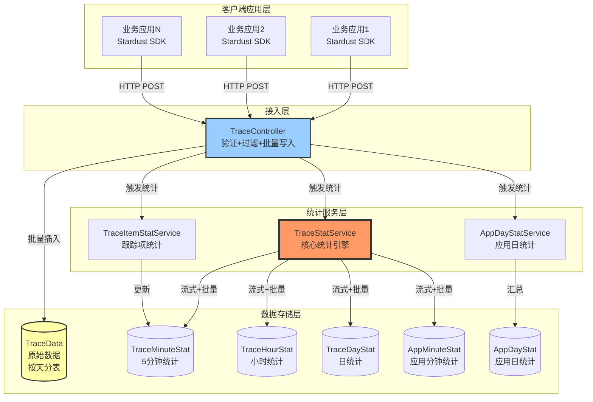

---

## 2. TraceStatService 核心流程

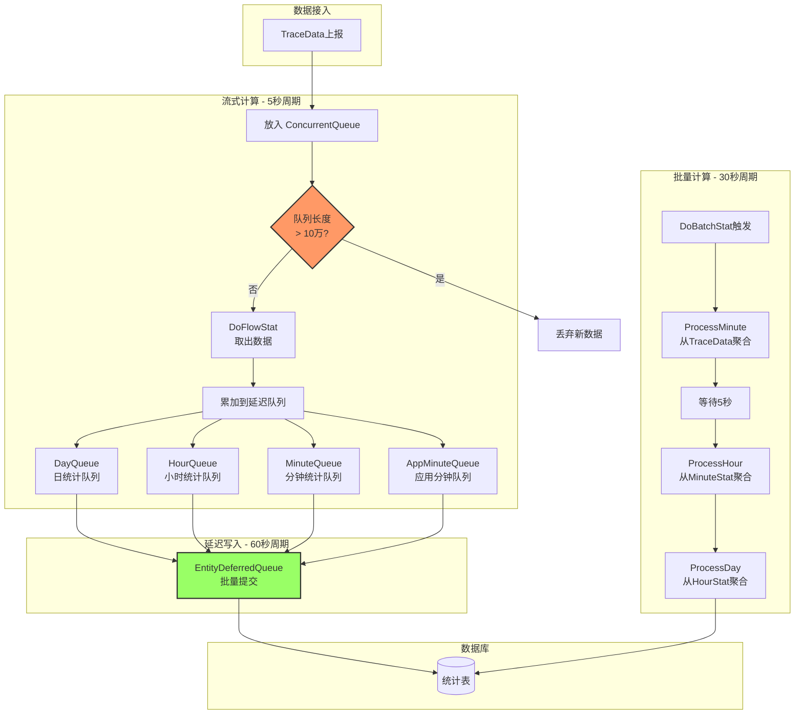

---

## 3. 数据流转时序图

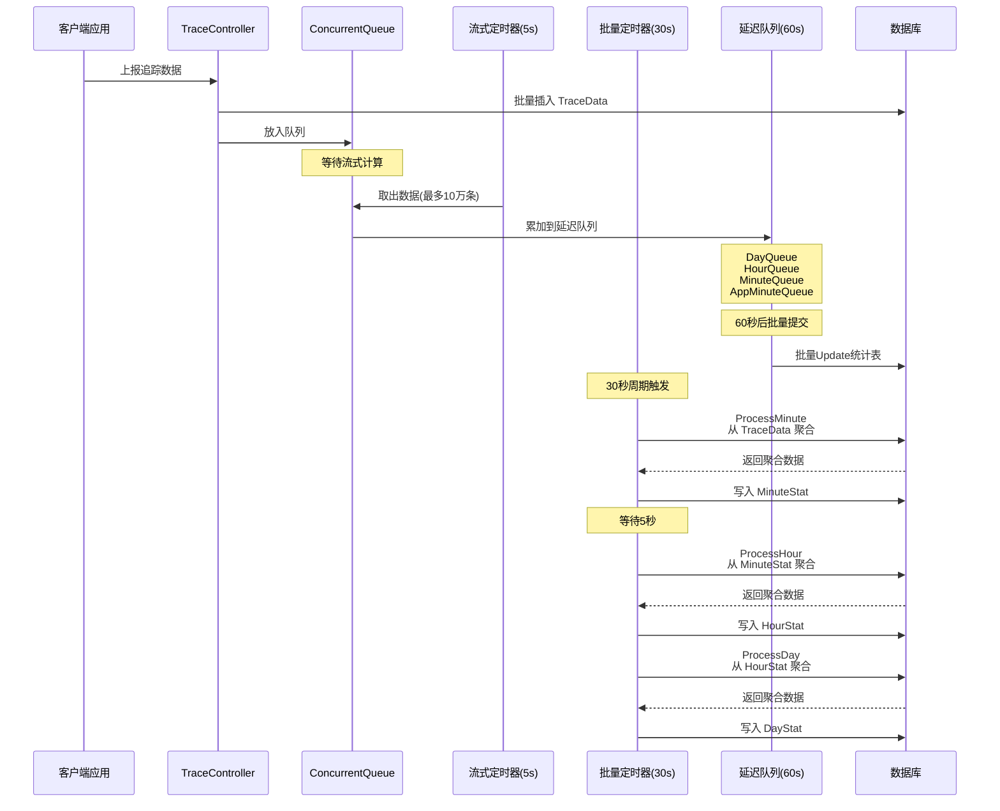

---

## 4. 数据模型层级关系

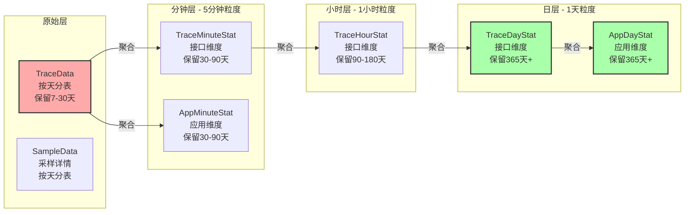

---

## 5. 性能瓶颈点分布

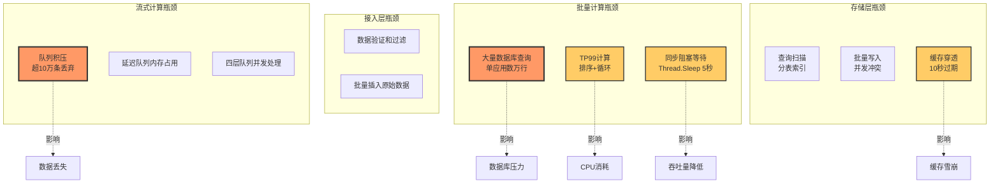

---

## 6. 优化路线图

```mermaid
graph LR
    subgraph "短期优化 1-2周"
        S1[增大队列容量<br/>10万→50万]
        S2[移除同步阻塞<br/>Thread.Sleep]
        S3[优化缓存策略<br/>10秒→30秒]
    end
    
    subgraph "中期优化 1-2月"
        M1[引入消息队列<br/>Kafka/RabbitMQ]
        M2[拆分统计服务<br/>微服务化]
        M3[优化TP99计算<br/>近似算法]
    end
    
    subgraph "长期优化 3-6月"
        L1[实时计算引擎<br/>Flink/Spark]
        L2[列式存储<br/>ClickHouse]
        L3[多级存储架构<br/>热温冷分离]
    end
    
    Current[当前状态<br/>80%资源占用] --> S1
    S1 --> S2
    S2 --> S3
    S3 -->|收益20-30%| M1
    M1 --> M2
    M2 --> M3
    M3 -->|收益50-100%| L1
    L1 --> L2
    L2 --> L3
    L3 -->|收益10-100倍| Future[目标状态<br/>支持亿级QPS]
    
    style Current fill:#f96,stroke:#333,stroke-width:2px
    style Future fill:#9f6,stroke:#333,stroke-width:2px
```

---

## 7. 缓存架构

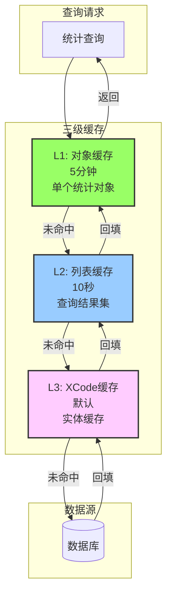

---

## 8. 分表策略

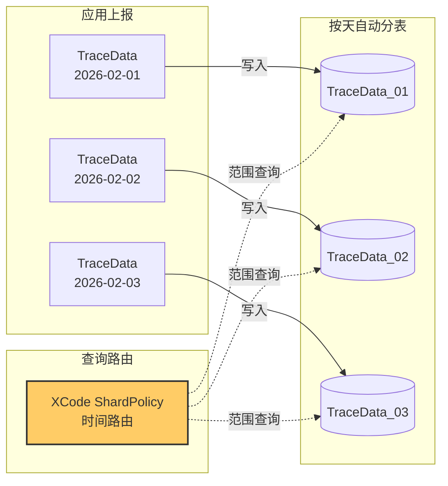

---

## 9. 双模式计算对比

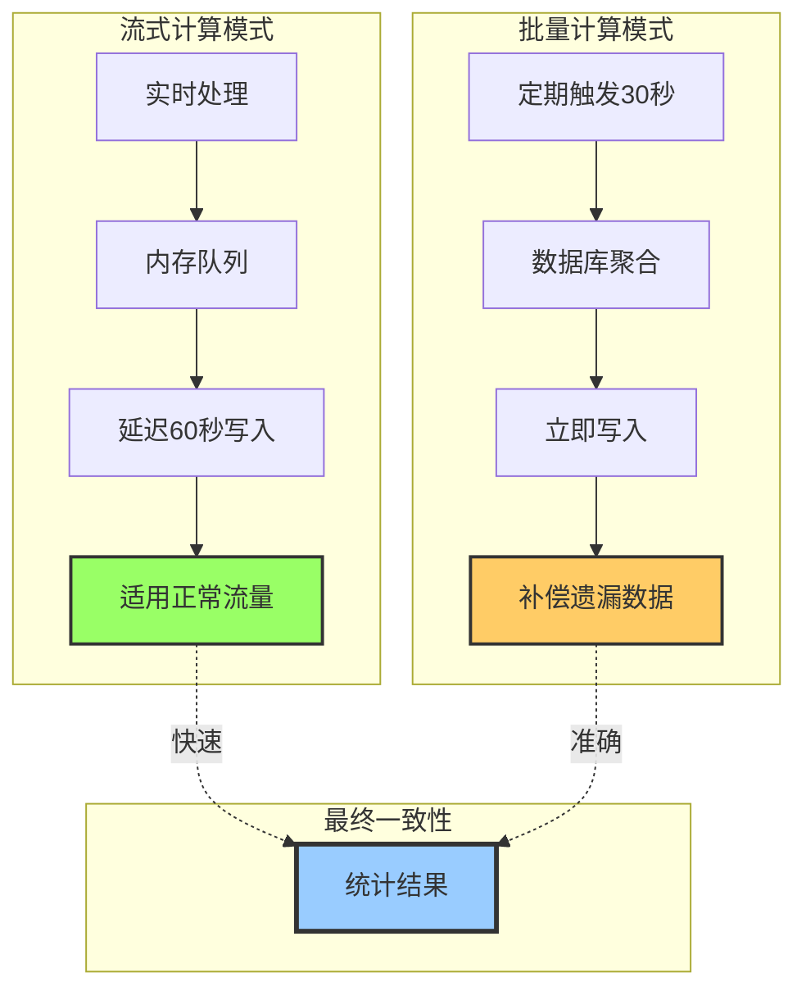

---

## 10. 资源消耗分布（预估）

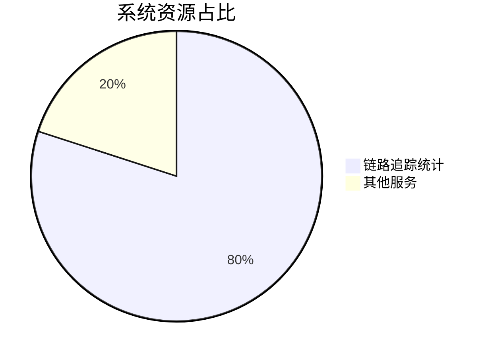

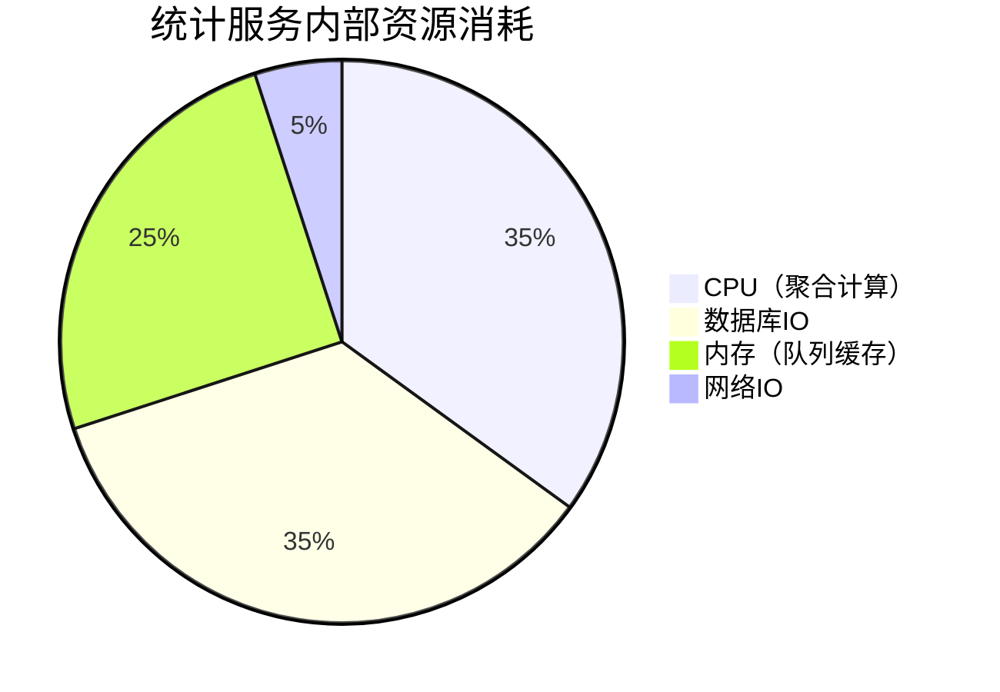

---

## 使用说明

以上图表使用 Mermaid 语法编写，可以在以下环境中渲染：

1. **GitHub/GitLab**: 原生支持 Mermaid 渲染
2. **VS Code**: 安装 `Markdown Preview Mermaid Support` 插件
3. **在线工具**: [Mermaid Live Editor](https://mermaid.live/)
4. **文档工具**: Notion、Obsidian 等支持 Mermaid 的工具

---

**最后更新：** 2026-02-02
