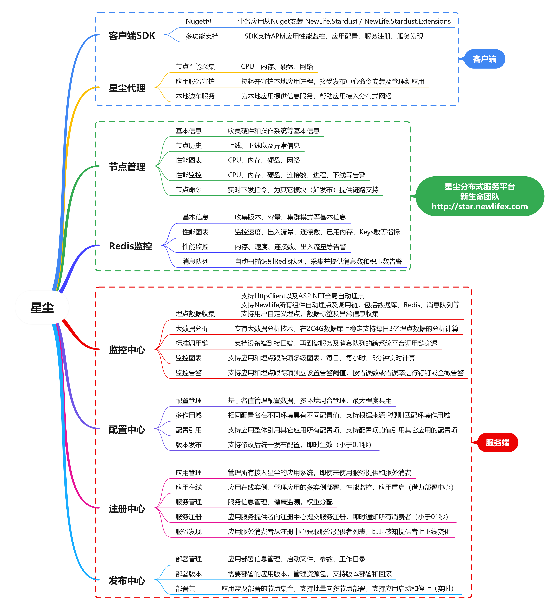
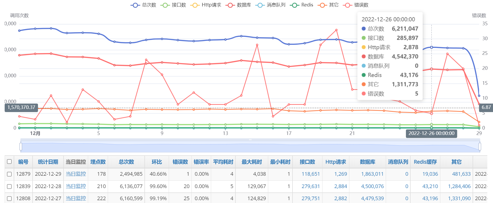
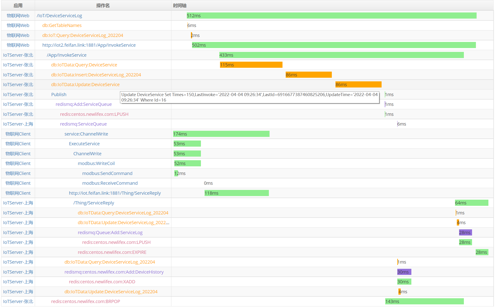
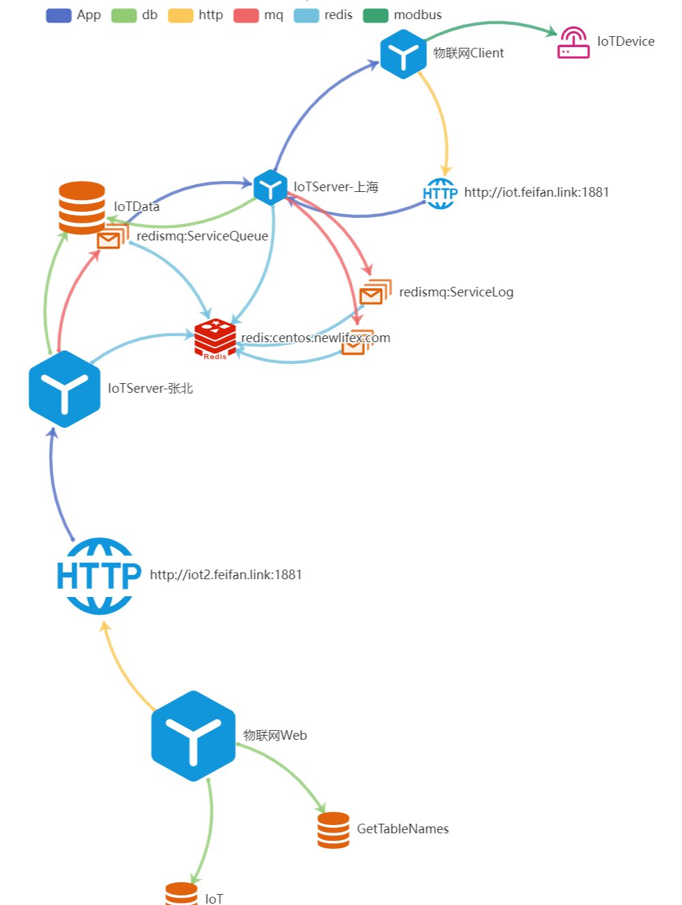

# NewLife.Stardust - 星尘分布式平台


## 星尘
应用服务犹如宇宙中的尘埃，而作为应用服务承载体的计算机节点是为星星，星星与尘埃构成整个浩瀚星空，即为星尘！  
  

Stardust  星尘，轻量级分布式服务框架！  
集群管理、配置中心、性能监控、远程发布、服务治理。服务自动注册和发现，负载均衡，动态伸缩，故障转移。  
演示系统：[http://star.newlifex.com](http://star.newlifex.com)

---
## 为什么选择星尘 (Why Stardust)
- 一体化：节点管理 / 配置中心 / 注册中心 / 服务发现 / 全链路追踪 / APM / 日志中心 / 远程发布 / 资源监控 统一模型与界面
- 超轻量：核心库零第三方重量级依赖，单进程即可运行，自动建库建表
- 强兼容：同一生态覆盖 .NET Framework 4.5 起至最新 .NET 9，多平台（Windows/Linux/ARM/IoT）
- 高性能：基于 NewLife.Core & NewLife.Net 等十余年优化积累，网络吞吐与序列化性能优异
- 极易接入：几行代码完成接入；ASP.NET Core / Console / Service / IoT 边缘统一方式
- 自带运维：StarAgent 守护进程 + 远程发布 + 指标 & 日志采集，极大降低分布式运维复杂度

---
## 架构总览
```
+--------------------+        +-------------------+        +---------------------+
|    应用实例 App    | <----> |  Registry/Config  | <----> |    StarServer 核心   |
| (UseStardust 扩展) |        | (服务/配置/发现)  |        |  (API & 任务/统计)   |
+---------+----------+        +---------+---------+        +----------+----------+
          |                               ^                           |
          v                               |                           v
   StarAgent (节点守护/部署/监控采集)      |                   StarWeb 管理界面
          |                               |                           |
       远程发布 / 性能 & 日志 / 指标上报 ---+--- 数据存储 (XCode ORM, 多数据库)
```
核心组件：
- StarServer：服务平台后端（API / 配置 / 注册 / 发布 / 指标聚合 / 统计计算）
- StarWeb：管理与可视化（基于 NewLife.Cube）
- StarAgent：安装在每台节点主机，进程守护、远程发布、采集监控（CPU/内存/网络/自定义）
- Stardust (Core Library)：客户端 SDK，提供配置拉取、注册发现、调用追踪、性能 & 日志上报
- Stardust.Extensions：ASP.NET Core 中间件扩展 (AddStardust / UseStardust / RegisterService / ConsumeService)
- 数据层 (Stardust.Data)：基于 XCode 的实体与统计任务
- StarGateway / DeployAgent（可选）：流量转发 / 构建与分发支撑

---
## 核心功能
1. [x] 星尘代理。StarAgent部署在每台应用服务器，作为系统服务负责守护本地应用及监控节点性能，支持Windows/Linux/IoT  
2. [x] 节点管理。中心化管理多机器上的海量StarAgent，支持机房内服务器节点、远端桌面工控机以及物联网边缘计算节点  
3. [x] 应用管理。为每个应用系统分配接入密钥，用于配置中心、应用监控、服务注册、服务发现等  
4. [x] 配置中心。各应用从配置中心读取自己的配置信息，有利于应用的多实例部署以及集中管理  
5. [x] 监控中心。各应用（服务提供者和服务消费者）向中心上报性能指标等监控数据  
6. [x] 注册中心。各微服务应用（服务提供者）向注册中心上报自身服务信息  
7. [x] 服务发现。各业务应用（服务消费者）从注册中心拉取指定服务的提供者信息，分布式调用（不经网关）  
8. [x] 远程发布。在星尘控制台上发布应用包到多台安装有星尘代理的应用服务器或物联网边缘节点，StarAgent负责拉起并守护进程  
9. [x] 日志中心。各应用（服务提供者和服务消费者）向中心上报日志数据，统一在星尘Web查看  

### 监控中心
星尘监控介绍 [https://newlifex.com/blood/stardust_monitor](https://newlifex.com/blood/stardust_monitor)  
应用监控
  
物联网平台远程控制花园水泵的调用链 [传送门](http://star.newlifex.com/trace?id=ac15452e1649035594650011be21ec)
  
关系图
  

---
## 组件说明
| 组件 | 功能 | 典型部署 | 说明 |
| ---- | ---- | -------- | ---- |
| StarServer | 注册 / 配置 / 发布 / 统计 API | 1~N | 可横向扩展，持久化依赖数据库/Redis(可选) |
| StarWeb | 管理与可视化界面 | 1 | 可与 StarServer 同机或分离 |
| StarAgent | 节点守护/监控/远程部署 | N(每机一实例) | 支持 Windows 服务、Linux systemd、容器或后台进程 |
| Stardust.Core(SDK) | 客户端接入 | 与业务应用同进程 | 通过 AddStardust/UseStardust 集成 |
| Stardust.Extensions | ASP.NET Core 扩展 | 业务 Web/API | 暴露中间件与注册/发现便捷方法 |
| StarGateway(可选) | 网关/反向代理 | 视需求 | 可与服务发现协同 |

---
## 快速开始 (Quick Start)
### 1. 获取源码 / 二进制
- 源码：clone 本仓库，使用 Visual Studio / Rider / `dotnet build` 直接编译
- NuGet：`NewLife.Stardust` (核心)；`NewLife.Stardust.Extensions` (ASP.NET Core 扩展)

### 2. 启动平台
1) 启动 StarServer：
```
cd Stardust.Server
dotnet run
```
2) 启动 StarWeb：
```
cd ../Stardust.Web
dotnet run
```
首次运行自动建库建表（默认 SQLite / 可配置 MySql / SqlServer / PostgreSql / Oracle / 达梦 等；在 `*.config` / `appsettings.*` 或环境变量中设置连接字符串）。

### 3. 部署 StarAgent 到业务节点
```
cd StarAgent
# 直接运行（调试）
dotnet run
# 或发布后安装为系统服务（示例）
dotnet publish -c Release -o publish
# Windows: StarAgent.exe -install
# Linux:   chmod +x StarAgent && ./StarAgent install
```
配置 StarServer 地址后，节点会在平台显示。

### 4. 创建应用 (StarWeb)
- 在“应用管理”中新建应用，生成 AppId / Secret
- 可配置分类、项目(Project)、预期端口、心跳策略等

### 5. 业务应用接入
引用包：
```
dotnet add package NewLife.Stardust.Extensions
```
在 Program / Startup：
```csharp
var builder = WebApplication.CreateBuilder(args);
var star = builder.Services.AddStardust("OrderService");
var app = builder.Build();
app.UseStardust();
app.RegisterService("OrderService"); // 注册到星尘
// app.ConsumeService("UserService"); // 可选：消费其它服务
app.Run();
```
运行后即可在 StarWeb 看到实例在线、性能指标与调用链。

---
## 配置中心使用
```csharp
var star = services.AddStardust("OrderService");
var cfg = star.GetConfig();
var dbConn = cfg["Db:ConnStr"]; // 自动从平台下发
```
在平台“配置中心”中为指定应用添加 Key=Value（支持分环境 / 分项目 / 模板继承），客户端自动长轮询/推送更新。修改后应用实例收到变更事件，可用于热更新业务参数。

---
## 服务注册与发现
- 注册：`app.RegisterService("SvcName", address: null, environment, healthUrl)`
  - 未显式 address 时自动解析本机可用地址
  - healthUrl 提供健康探针
- 发现：`app.ConsumeService("SvcName");`
  - 自动维护提供者列表，支持轮询负载 / 故障剔除
  - 也可通过 `ServiceProviderResolver` 自定义策略

---
## 全链路追踪 & 指标
SDK 内置 ITracer，进入点会自动创建 span；你也可以：
```csharp
using var span = star.Tracer?.NewSpan("biz:calc", new { id });
```
采集：
- 性能计数（QPS、耗时分布、错误率）
- 系统指标（Agent：CPU/内存/线程/网络）
- 日志：通过 NewLife.Log 上报；在 Web 中统一查询

---
## 远程发布 / 持续交付
1. 在“发布中心”创建发布应用，填写：Repository / Branch / ProjectPath / PackageFilters / 编译参数
2. 绑定目标节点（StarAgent）
3. 触发构建：平台拉取代码 → 构建 → 打包过滤 → 分发至节点 → Agent 解压部署 → 守护运行
4. 支持灰度：选择子集节点发布，验证后全量
5. 回滚：历史版本包保留，可一键回滚

---
## 安全与权限
- 继承 NewLife.Cube 权限体系（用户 / 角色 / 菜单 / 数据权限）
- AppId + Secret 仅在创建时可见，请妥善保存
- 支持按项目(Project)与分类(Category)进行资源隔离

---
## 数据与存储
- ORM：XCode (自动建表/迁移/分表/读写分离)
- 支持：SQLite / MySql / SqlServer / Oracle / PostgreSql / 达梦 等
- 指标、追踪、日志分表存储，长期运行自动归档与清理（后台计划任务）

---
## 性能特性
- 高吞吐网络栈（源自 NewLife.Net）
- 零侵入 APM：最少埋点即可统计
- 多级缓存与 Redis 可选集成（Stardust.Server 使用 Redis 统计加速可选）
- 低 GC：内部使用对象池 / 字符串构建池

---
## 与常见方案对比 (概念性)
| 诉求 | 星尘 | 单一注册中心 (如 Consul/Eureka) | 仅配置中心 | 传统脚本发布 |
| ---- | ---- | ------------------------------- | --------- | ------------ |
| 功能覆盖 | 注册/发现/配置/发布/监控/追踪 | 注册 + 健康 | 配置 | 仅分发 |
| 接入复杂度 | 低 | 中 | 中 | 高 |
| 运维统一度 | 高 | 中 | 中 | 低 |
| 语言生态 | 以 .NET 为主 | 多语言 | 多语言 | 任意 |
| 远程发布 | 内置 | 否 | 否 | 需自建 |

---
## FAQ (节选)
Q: 是否必须同时部署 StarServer 与 StarWeb?  
A: 可同机；StarWeb 负责管理界面，StarServer 提供核心 API。小规模可同机部署，也可分离扩展。  

Q: Agent 必须安装系统服务吗?  
A: 推荐服务方式以保证宕机自恢复；也可容器模式或前台调试运行。  

Q: 支持容器 / K8s 吗?  
A: 支持。Agent 可作为 DaemonSet，业务 Pod 通过 SDK 接入；后续可结合 StarGateway 做入口治理。  

Q: 配置热更新需要重启应用吗?  
A: 不需要。SDK 自动监听，提供变更回调。  

Q: 如何定制发布流程?  
A: 可扩展构建脚本或在 Repository 中附加自定义打包脚本，再由平台执行。  

---
## 升级与兼容
- 多目标框架同时发布，保证老版本应用可逐步迁移
- 新增字段保持向后兼容；删除或变更公共 API 先打 `[Obsolete]`
- 建议升级顺序：StarServer/StarWeb → StarAgent → 业务 SDK

---
## 生态集成
可与以下 NewLife 项目协同：
- NewLife.Redis：高性能缓存 & 队列
- NewLife.Remoting：RPC / HTTP 混合通信
- NewLife.XCode：大数据 ORM
- NewLife.Agent：守护服务能力（Agent 已内置）

---
## 快速拥有

​	使用NewLife组件的最简便方式是从Nuget引用，例如在项目Nuget管理中搜索`NewLife.Stardust` 并引入。

​	NewLife组件由社区共创20多年，使用MIT开源协议，**任何人可任意修改并再次发行**（无需声明来源）！许多企业基于此构建内部开发框架时，甚至可通过批量替换源码中所有`NewLife`字符串为贵公司名实现私有化定制。

​	团队始终秉承开放态度，不仅支持VisualStudio（最新正式版）打开解决方案编译，也兼容`dotnet build`命令行编译，项目文件摒弃复杂功能以追求简单易用，真正做到开箱即用。

​	我们公开强命名证书`newlife.snk`以支持独自编译替换程序集。


​	命令行中运行以下命令快速体验NewLife组件：

```
dotnet new install NewLife.Templates
dotnet new nconsole --name test
cd test
dotnet run
```


## 新生命项目矩阵
各项目默认支持net9.0/netstandard2.1/netstandard2.0/net4.62/net4.5，旧版（2024.0801）支持net4.0/net2.0  

|                               项目                               | 年份  | 说明                                                                                        |
| :--------------------------------------------------------------: | :---: | ------------------------------------------------------------------------------------------- |
|                             基础组件                             |       | 支撑其它中间件以及产品项目                                                                  |
|          [NewLife.Core](https://github.com/NewLifeX/X)           | 2002  | 核心库，日志、配置、缓存、网络、序列化、APM性能追踪                                         |
|    [NewLife.XCode](https://github.com/NewLifeX/NewLife.XCode)    | 2005  | 大数据中间件，单表百亿级，MySql/SQLite/SqlServer/Oracle/PostgreSql/达梦，自动分表，读写分离 |
|      [NewLife.Net](https://github.com/NewLifeX/NewLife.Net)      | 2005  | 网络库，单机千万级吞吐率（2266万tps），单机百万级连接（400万Tcp长连接）                     |
| [NewLife.Remoting](https://github.com/NewLifeX/NewLife.Remoting) | 2011  | 协议通信库，提供CS应用通信框架，支持Http/RPC通信框架，高吞吐，物联网设备低开销易接入        |
|     [NewLife.Cube](https://github.com/NewLifeX/NewLife.Cube)     | 2010  | 魔方快速开发平台，集成了用户权限、SSO登录、OAuth服务端等，单表100亿级项目验证               |
|    [NewLife.Agent](https://github.com/NewLifeX/NewLife.Agent)    | 2008  | 服务管理组件，把应用安装成为操作系统守护进程，Windows服务、Linux的Systemd                   |
|     [NewLife.Zero](https://github.com/NewLifeX/NewLife.Zero)     | 2020  | Zero零代脚手架，基于NewLife组件生态的项目模板NewLife.Templates，Web、WebApi、Service        |
|                              中间件                              |       | 对接知名中间件平台                                                                          |
|    [NewLife.Redis](https://github.com/NewLifeX/NewLife.Redis)    | 2017  | Redis客户端，微秒级延迟，百万级吞吐，丰富的消息队列，百亿级数据量项目验证                   |
| [NewLife.RocketMQ](https://github.com/NewLifeX/NewLife.RocketMQ) | 2018  | RocketMQ纯托管客户端，支持Apache RocketMQ和阿里云消息队列，十亿级项目验                     |
|     [NewLife.MQTT](https://github.com/NewLifeX/NewLife.MQTT)     | 2019  | 物联网消息协议，MqttClient/MqttServer，客户端支持阿里云物联网                               |
|      [NewLife.IoT](https://github.com/NewLifeX/NewLife.IoT)      | 2022  | IoT标准库，定义物联网领域的各种通信协议标准规范                                             |
|   [NewLife.Modbus](https://github.com/NewLifeX/NewLife.Modbus)   | 2022  | ModbusTcp/ModbusRTU/ModbusASCII，基于IoT标准库实现，支持ZeroIoT平台和IoTEdge网关            |
|  [NewLife.Siemens](https://github.com/NewLifeX/NewLife.Siemens)  | 2022  | 西门子PLC协议，基于IoT标准库实现，支持IoT平台和IoTEdge                                      |
|      [NewLife.Map](https://github.com/NewLifeX/NewLife.Map)      | 2022  | 地图组件库，封装百度地图、高德地图、腾讯地图、天地图                                        |
|    [NewLife.Audio](https://github.com/NewLifeX/NewLife.Audio)    | 2023  | 音频编解码库，PCM/ADPCMA/G711A/G722U/WAV/AAC                                                |
|                             产品平台                             |       | 产品平台级，编译部署即用，个性化自定义                                                      |
|         [Stardust](https://github.com/NewLifeX/Stardust)         | 2018  | 星尘，分布式服务平台，节点管理、APM监控中心、配置中心、注册中心、发布中心                   |
|           [AntJob](https://github.com/NewLifeX/AntJob)           | 2019  | 蚂蚁调度，分布式大数据计算平台（实时/离线），蚂蚁搬家分片思想，万亿级数据量项目验证         |
|      [NewLife.ERP](https://github.com/NewLifeX/NewLife.ERP)      | 2021  | 企业ERP，产品管理、客户管理、销售管理、供应商管理                                           |
|         [CrazyCoder](https://github.com/NewLifeX/XCoder)         | 2006  | 码神工具，众多开发者工具，网络、串口、加解密、正则表达式、Modbus、MQTT                      |
|           [EasyIO](https://github.com/NewLifeX/EasyIO)           | 2023  | 简易文件存储，支持分布式系统中文件集中存储。                                                |
|           [XProxy](https://github.com/NewLifeX/XProxy)           | 2005  | 产品级反向代理，NAT代理、Http代理                                                           |
|        [HttpMeter](https://github.com/NewLifeX/HttpMeter)        | 2022  | Http压力测试工具                                                                            |
|         [GitCandy](https://github.com/NewLifeX/GitCandy)         | 2015  | Git源代码管理系统                                                                           |
|          [SmartOS](https://github.com/NewLifeX/SmartOS)          | 2014  | 嵌入式操作系统，完全独立自主，支持ARM Cortex-M芯片架构                                      |
|          [SmartA2](https://github.com/NewLifeX/SmartA2)          | 2019  | 嵌入式工业计算机，物联网边缘网关，高性能.NET8主机，应用于工业、农业、交通、医疗             |
|                          FIoT物联网平台                          | 2020  | 物联网整体解决方案，建筑、环保、农业，软硬件及大数据分析一体化，单机十万级点位项目验证      |
|                        UWB高精度室内定位                         | 2020  | 厘米级（10~20cm）高精度室内定位，软硬件一体化，与其它系统联动，大型展厅项目验证             |


## 新生命开发团队
  

新生命团队（NewLife）成立于2002年，是新时代物联网行业解决方案提供者，致力于提供软硬件应用方案咨询、系统架构规划与开发服务。  
团队主导的80多个开源项目已被广泛应用于各行业，Nuget累计下载量高达400余万次。  
团队开发的大数据中间件NewLife.XCode、蚂蚁调度计算平台AntJob、星尘分布式平台Stardust、缓存队列组件NewLife.Redis以及物联网平台FIoT，均成功应用于电力、高校、互联网、电信、交通、物流、工控、医疗、文博等行业，为客户提供了大量先进、可靠、安全、高质量、易扩展的产品和系统集成服务。  

我们将不断通过服务的持续改进，成为客户长期信赖的合作伙伴，通过不断的创新和发展，成为国内优秀的IoT服务供应商。  

`新生命团队始于2002年，部分开源项目具有20年以上漫长历史，源码库保留有2010年以来所有修改记录`  
网站：https://newlifex.com  
开源：https://github.com/newlifex  
QQ群：1600800/1600838  
微信公众号：  
  

---
## License
MIT License. Copyright (c) 2002-2025 NewLife.

欢迎 Star / Fork / Issue / PR，共建更完善的 .NET 分布式基础设施。
